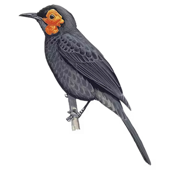
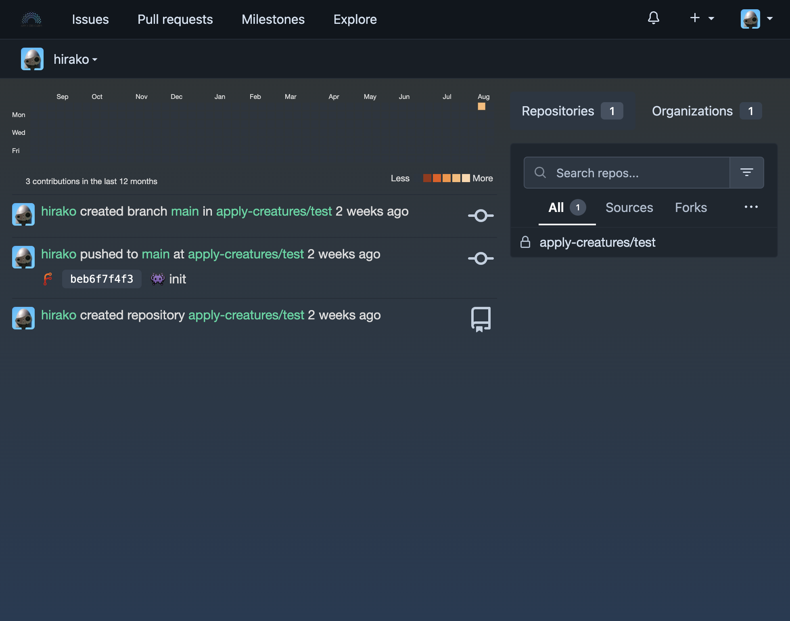

<!-- PROJECT SHIELDS -->
[![Codacy Badge][codacy-shield]][codacy-url]
[![Issues][issues-shield]][issues-url]
[![Forks][forks-shield]][forks-url]
[![Stargazers][stars-shield]][stars-url]
[![repo-size][repo-size-shield]][repo-size-url]
[![Contributors][contributors-shield]][contributors-url]
[![license][license-shield]][license-url]

<!-- PROJECT LOGO -->
<br />
<div align="center">

  <h3 align="center">creature-foja</h3>

   <a href="#">
      
   </a>

  <p align="center">
    Foja
    <br />
    <a href="https://foja.applycreatures.com"><strong>See live »</strong></a>
    <br />
    <br />
    <a href="https://github.com/apply-creatures/creature-foja/issues">Report Bug</a>
    ::
    <a href="https://github.com/apply-creatures/creature-foja/issues">Request Feature</a>
  </p>
</div>

<p align="center">
OK, DOkey
</p>

<!-- TABLE OF CONTENTS -->
<details>
  <summary>Table of Contents</summary>
      <ol>
         <li>
            <a href="#about">About</a>
            <ul>
                <li>
                    <a href="#built-with">Built With</a>
                </li>
            </ul>
         </li>
         <li>
         <a href="#getting-started">Getting Started</a>
         <ul>
            <li><a href="#prerequisites">Prerequisites</a></li>
            <li><a href="#repo">Repo</a></li>
            <li><a href="#develop">Develop</a></li>
            <li><a href="#build">Build</a></li>
            <li><a href="#deploy">Deploy</a></li>
         </ul>
         </li>
         <li><a href="#roadmap">Roadmap</a></li>
         <li><a href="#contributing">Contributing</a></li>
         <li><a href="#license">License</a></li>
         <li><a href="#acknowledgments">Acknowledgments</a></li>
      </ol>
</details>

<hr/>

**TL;DR** - skip to [getting-started](#getting-started)


<hr/>

<!-- ABOUT THE PROJECT -->

## About

A forge to keep repositories. It is Built over Forgejo, which itself is built over Gitea.

<div align="center">
   <a href="#">
      
   </a>
</div>

## Features

* Repositories
* Pull and Push
* Issues

Of course, nothing is perfect, but I will try to keep this up to date and fix issues right here.
If you've truly tried everything and still can't get this to work for you, try to reach out. Or raise an issue. But I make no promise

<p align="right">(<a href="#readme-top">back to top</a>)</p>

### Built With

- Foja over Gitea
- Go

<hr/>

<!-- GETTING STARTED -->

## Getting Started

### Prerequisites

- you need [Git](https://git-scm.com/) installed
- And Docker
- Go (optional)

### Set up repo

```bash
$ git clone https://github.com/apply-creatures/creature-foja.git
```

### Develop

**Launch in develop mode**

- TODO

**Access via browser**

- TODO

### Build

This command will compile for production deployment:

```bash
$ TODO
```

### Deploy

Via docker. Or fly.toml

```bash
$ fly deploy # first time would be fly launch
```
<p align="right">(<a href="#readme-top">back to top</a>)</p>

<hr/>

## Roadmap

- [x] Setup the repo
- [x] Make Dockerfile work
- [x] Deployment and volume config
- [x] Tweak landing page and theme

<hr/>

## Contributing

Contributions are what make the open source community such an amazing place to learn, inspire, and create. Any contributions you make are **greatly appreciated**.

If you have a suggestion that would make this better, please fork the repo and create a pull request. You can also simply open an issue with the tag "enhancement".
Don't forget to give the project a star! Thanks again!

1. Fork the Project
2. Create your Feature Branch (`git checkout -b feature/some-feature`)
3. Commit your Changes (`git commit -m 'Add some feature'`)
4. Push to the Branch (`git push origin feature/some-feature`)
5. Open a Pull Request

For more on how to contribute and the code of conduct, see [CONTRIBUTING.md](./CONTRIBUTING.md).

### Security

To report vulnerabilities, see [SECURITY.md](SECURITY.md).

<hr/>

<p align="right">(<a href="#readme-top">back to top</a>)</p>

<hr/>

## Acknowledgments

It would never end. I've done this work not just off dozens of other people's open source work, but hundreds, thousands, or maybe millions.

<!-- Refs -->

[codacy-url]: https://app.codacy.com/gh/apply-creatures/creature-foja/dashboard
[codacy-shield]: https://img.shields.io/codacy/grade/appid?style=for-the-badge
[contributors-shield]: https://img.shields.io/github/contributors/apply-creatures/creature-foja.svg?style=for-the-badge
[contributors-url]: https://github.com/apply-creatures/creature-foja/graphs/contributors
[forks-shield]: https://img.shields.io/github/forks/apply-creatures/creature-foja.svg?style=for-the-badge
[forks-url]: https://github.com/apply-creatures/creature-foja/network/members
[stars-shield]: https://img.shields.io/github/stars/apply-creatures/creature-foja.svg?style=for-the-badge
[stars-url]: https://github.com/apply-creatures/creature-foja/stargazers
[issues-shield]: https://img.shields.io/github/issues/apply-creatures/creature-foja.svg?style=for-the-badge
[issues-url]: https://github.com/apply-creatures/creature-foja/issues
[license-shield]: https://img.shields.io/github/license/apply-creatures/creature-foja.svg?style=for-the-badge
[license-url]: https://github.com/apply-creatures/creature-foja/blob/main/LICENSE
[score-shield]: https://img.shields.io/ossf-scorecard/github.com/apply-creatures/creature-foja?style=for-the-badge
[score-url]: https://github.com/apply-creatures/creature-foja
[repo-size-shield]: https://img.shields.io/github/repo-size/apply-creatures/creature-foja?style=for-the-badge
[repo-size-url]: https://github.com/apply-creatures/creature-foja/archive/refs/heads/main.zip
[product-screenshot]: images/apply-creatures-logo.png

## Changelog

Changelog see [here](CHANGELOG.md)

## License

[![license][license-shield]][license-url]

If you too produce work and publish it out there, it's clearer to choose a [license](https://choosealicense.com).
