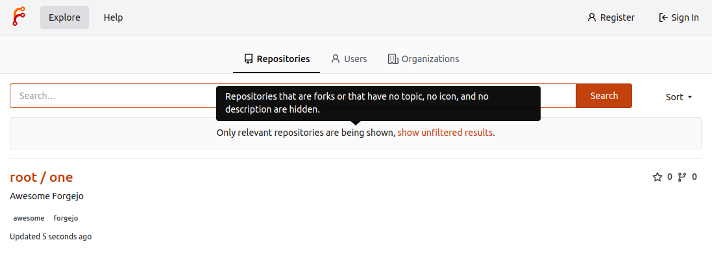
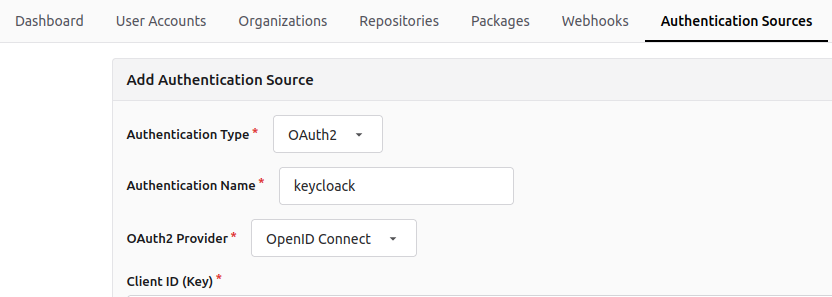
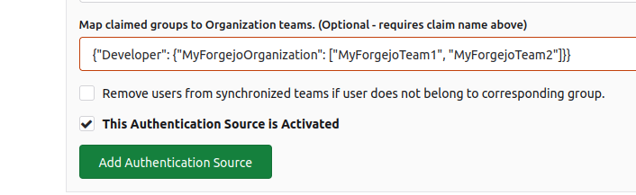
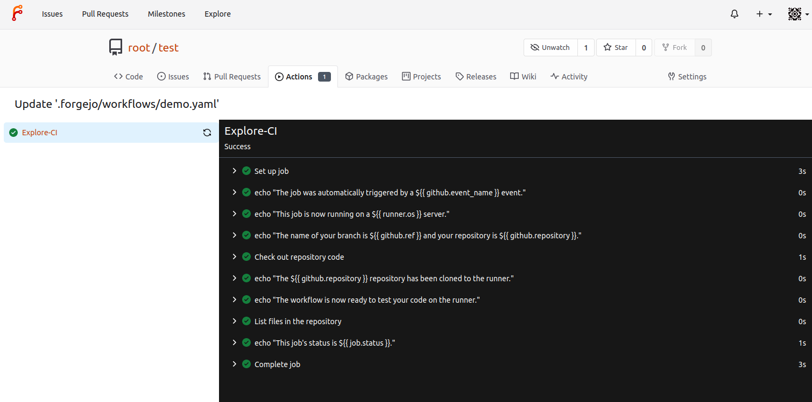
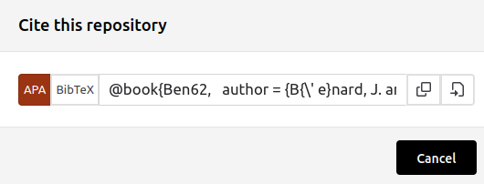
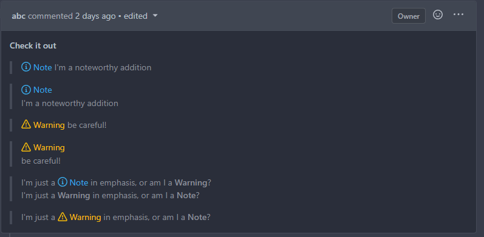
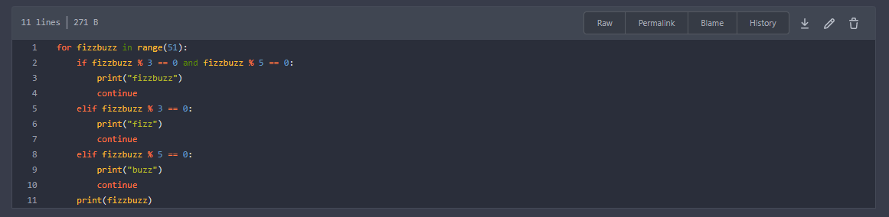
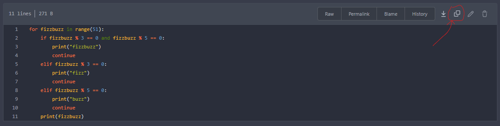
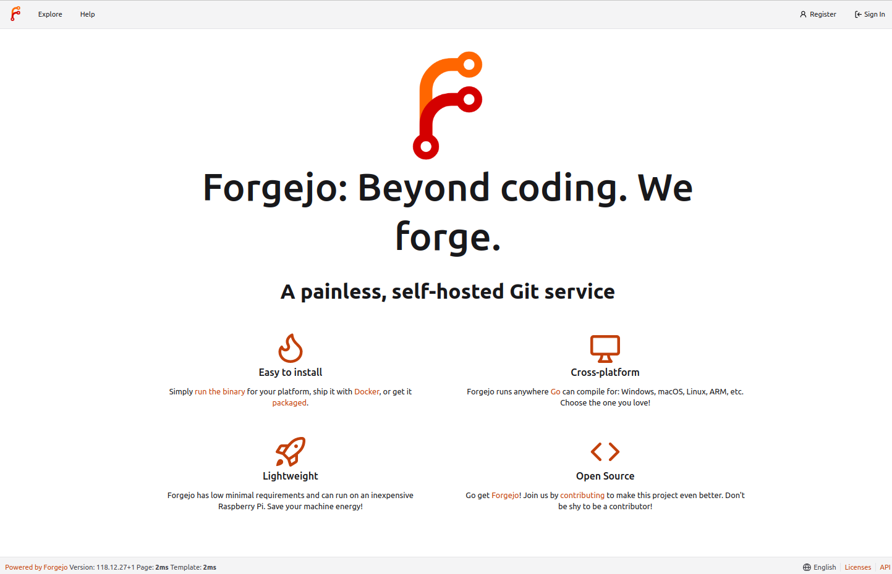

# Release Notes

A Forgejo release is published shortly after a Gitea release is published and they have [matching release numbers](https://codeberg.org/forgejo/forgejo/src/branch/forgejo/CONTRIBUTING/RELEASE.md#release-numbering). Additional Forgejo releases may be published to address urgent security issues or bug fixes.

The Forgejo admin should carefully read the required manual actions before upgrading. A point release (e.g. v1.21.1-0 or v1.21.2-0) does not require manual actions but others might (e.g. v1.20, v1.21).

## 1.21.4-0

The [complete list of commits](https://codeberg.org/forgejo/forgejo/commits/branch/v1.21/forgejo) included in the `Forgejo v1.21.4-0` release can be reviewed from the command line with:

```shell
$ git clone https://codeberg.org/forgejo/forgejo/
$ git -C forgejo log --oneline --no-merges v1.21.3-0..v1.21.4-0
```

This stable release includes security and bug fixes as well as documentation improvements.

* Recommended Action

  We recommend that all Forgejo installations are [upgraded](https://forgejo.org/docs/v1.21/admin/upgrade/) to the latest version.

* Container image upgrades

  In the Forgejo container images the ssh version was upgraded to [9.3_p2-r1](https://pkgs.alpinelinux.org/packages?name=openssh&branch=v3.18) which includes a fix for [CVE-2023-48795](https://nvd.nist.gov/vuln/detail/CVE-2023-48795).

* [Forgejo Semantic Version](https://forgejo.org/docs/v1.21/user/semver/)

  The semantic version was updated to `6.0.4+0-gitea-1.21.4`

* Security fixes

  * [Update github.com/cloudflare/circl](https://codeberg.org/forgejo/forgejo/commit/82ec85550e8604725e98c30e2d0f884db7514018)
  * [Require token for GET subscription endpoint](https://codeberg.org/forgejo/forgejo/commit/0841fb63a198b416a66268d8104daa4299d40107)

* Bug fixes

  The most prominent ones are described here, others can be found in the list of commits included in the release as described above.

  * [Gracefully handle missing branches](https://codeberg.org/forgejo/forgejo/commit/c2fa9c308f5cdb08dd84fb8ec6623a57e75d5152) when a branch is missing from Git but still lingering in the database.
  * [Fix panic in `canSoftDeleteContentHistory`](https://codeberg.org/forgejo/forgejo/commit/ab1ccc55dca7fd05e59a01343e6dfe53be6195d0)
  * [Check for Commit in opengraph](https://codeberg.org/forgejo/forgejo/commit/b473a44a2bb59591f3e24bfcdeed1d8fbb0f9204)
  * [Handle non-existant commit in Archive request](https://codeberg.org/forgejo/forgejo/commit/0fbf761d1930f9336be6da8d17ae6032203a9381)
  * [Fix NPE in `ToPullReviewList`](https://codeberg.org/forgejo/forgejo/commit/f5349b66b78968301d7dc4c45e8e08b46910aa6e)
  * [Fix URL in the mail to include the host](https://codeberg.org/forgejo/forgejo/commit/ac889d42903b2ce2129a02ace620a10a6f940920)
  * [Fix the event of a scheduled action](https://codeberg.org/forgejo/forgejo/commit/892a8e1f4a5cc09cc3136e0b0e6487c154c5ed2b) to be "schedule" instead of a semi-random event from the default branch.
  * [Use refname:strip-2 instead of refname:short when syncing tags](https://codeberg.org/forgejo/forgejo/commit/4df056a14ecaad3ff9d963599fff8c8d7ebe87e9)
  * [Fix button size in "attached header right"](https://codeberg.org/forgejo/forgejo/commit/10699872930005a79490dd47eb86438ff20f449d)
  * [Fix `convert.ToTeams` on empty input](https://codeberg.org/forgejo/forgejo/commit/453d27853c18991c13b6e457032406664b07751b)
  * [Hide code related setting options in repository when code unit is disabled](https://codeberg.org/forgejo/forgejo/commit/703ed272ccba55c08873f6a23e557cdc5cd498ee)
  * [Fix incorrect URL for "Reference in New Issue"](https://codeberg.org/forgejo/forgejo/commit/01285dc47cd77e7c0755423af96ba6bf0e23650e)
  * [Fix panic when parsing empty pgsql host](https://codeberg.org/forgejo/forgejo/commit/ad027c28181004cbf891be14bb383ed906b13521)
  * [Fix alpine package files are not rebuilt](https://codeberg.org/forgejo/forgejo/commit/881159f593b8f848d52afe8d420f4f3ced34de7f)
  * [Avoid cycle-redirecting user/login page](https://codeberg.org/forgejo/forgejo/commit/ea8ca5b5098d04bf5f6218ca099af32d20bb465f)
  * [Fix the scroll behavior for emoji/mention list](https://codeberg.org/forgejo/forgejo/commit/fef19bcf94b2265870d21897e9bc55d6a07975d7)
  * [Fix wrong due date rendering in issue list page](https://codeberg.org/forgejo/forgejo/commit/29a0e7738c0725ee8407e2714c3d890286a94fd0)
  * [Fix `status_check_contexts` matching bug](https://codeberg.org/forgejo/forgejo/commit/3fe44b87627612705413e80abbe8af55fae36666)
  * [Fix 405 method not allowed CORS / OIDC](https://codeberg.org/forgejo/forgejo/commit/9ad7a67fc127712f897a3c8348e9f55d7cb2f6ec)
  * [Fix `GetCommitStatuses`](https://codeberg.org/forgejo/forgejo/commit/c287b1383f91024a8eba1a3f47912eecd66e19be)
  * [Forbid removing the last admin user](https://codeberg.org/forgejo/forgejo/commit/5124be72aaac4ad814c1ec7a57a2e92c529d00f9)
  * [Fix issue dependencies](https://codeberg.org/forgejo/forgejo/commit/2ab54a9c0671b70ab83bd3c643815ac7424a6a36)
  * [Fix system webhooks API bug](https://codeberg.org/forgejo/forgejo/commit/f5764bbf269d82e7e344834a5eeb8de82356cfde)

* Documentation

  * The Forgejo Actions [user reference guide](https://forgejo.org/docs/v1.21/user/actions/) includes [event payload examples](https://forgejo.org/docs/v1.21/user/actions/#githubevent) for pull requests and push events. It also covers most of the [jobs](https://forgejo.org/docs/v1.21/user/actions/#jobs) syntax.
  * The [Forgejo command line page](https://forgejo.org/docs/v1.21/admin/command-line/) was [entirely reworked](https://codeberg.org/forgejo/docs/pulls/340) and updates are now automated.

* Improvements

  * [Rework markup link rendering](https://codeberg.org/forgejo/forgejo/commit/875b398e5e0c53a615c861eba77d4e0ff50ff49d)
  * [Modernize merge button](https://codeberg.org/forgejo/forgejo/commit/70c7ee54754e93fd2612287b1ccfc24006924651)
  * [Assign pull request to project during creation](https://codeberg.org/forgejo/forgejo/commit/10b555a52b0541fa5e4bc3ddb43001abc2ce0c76)
  * [Add download attribute to release attachments](https://codeberg.org/forgejo/forgejo/commit/fab93c6393f5365e2e985619f0b82e4c580874c9)

## 1.21.3-0

The [complete list of commits](https://codeberg.org/forgejo/forgejo/commits/branch/v1.21/forgejo) included in the `Forgejo v1.21.3-0` release can be reviewed from the command line with:

```shell
$ git clone https://codeberg.org/forgejo/forgejo/
$ git -C forgejo log --oneline --no-merges v1.21.2-1..v1.21.3-0
```

This stable release includes bug fixes. It was built with an updated version of the [Go Cryptography](https://pkg.go.dev/golang.org/x/crypto) package that fixes [CVE-2023-48795](https://go.dev/issue/64784). As explained in the [corresponding Go issue](https://github.com/golang/vulndb/issues/2402): "The impact of this attack is relatively limited, as it does not compromise confidentiality of the channel."

* Recommended Action

  We recommend that all Forgejo installations are [upgraded](https://forgejo.org/docs/v1.21/admin/upgrade/) to the latest version.

* [Forgejo Semantic Version](https://forgejo.org/docs/v1.21/user/semver/)

  The semantic version was updated to `6.0.3+0-gitea-1.21.3`

* Security fix

  * The [Go Cryptography](https://pkg.go.dev/golang.org/x/crypto) package [is upgraded](https://codeberg.org/forgejo/forgejo/commit/9515a0ea38c179a2811e489079a68bbcc79f3cd3) to fix [CVE-2023-48795](https://go.dev/issue/64784).

* Bug fixes

  The most prominent ones are described here, others can be found in the list of commits included in the release as described above.

  * [Fix a regression](https://codeberg.org/forgejo/forgejo/commit/dbd896ce42b2c5a1f4b4a69289fa3a38a875d04d) in how the markdown anchors are generated. For instance the anchor for `A.B.C` is `A-B-C` but was incorrectly set to `ABC`.
  * [Fix the branch name of scheduled actions](https://codeberg.org/forgejo/forgejo/commit/580f29d9a2f8986c02b6ac30f2f3c177866cc81a) which [was sometime incorrectly set](https://codeberg.org/forgejo/forgejo/issues/1926).
  * [Fix a visual glitch](https://codeberg.org/forgejo/forgejo/commit/b0874a0912ee97b11047bb2bd7d370b93c298d2a) when [setting an emoji in the web UI](https://codeberg.org/forgejo/forgejo/issues/1990).
  * [Recently Docker started to use the optional `POST /v2/token` endpoint](https://codeberg.org/forgejo/forgejo/commit/a77398cd344be76e1cd2474063d917b286f8e9b1) which should respond with a `404 Not Found` status code instead of the current `405 Method Not Allowed`.
  * [Fix a missing leading ssh:// when using a port other than 22](https://codeberg.org/forgejo/forgejo/commit/1475c1fcc4f1d5d526260a3f2068ae62c2ccaae3) when Git URLs are displayed in the web UI.
  * [Allow disabling the detection of ambiguous unicode characters](https://codeberg.org/forgejo/forgejo/commit/cd5a0ec1c88edc238469657731e209a0080e9bfc) with the new setting `AMBIGUOUS_UNICODE_DETECTION=false`.
  * [Fix a regression with the issue references rendering in wiki pages](https://codeberg.org/forgejo/forgejo/commit/40fa6a526a1cb42889eddd5135f2749cc092fff5).
  * [Fix merging artifact chunks error when minio storage basepath is set](https://codeberg.org/forgejo/forgejo/commit/bea2c52572d62781228099812e56b2e7051e7ab0)
  * [Fix missing information in the blame page web UI](https://codeberg.org/forgejo/forgejo/commit/1f8d01c74d75c0b426b7b7a95cc1ca3bfe1b853c).

## 1.21.2-1

The [complete list of commits](https://codeberg.org/forgejo/forgejo/commits/branch/v1.21/forgejo) included in the `Forgejo v1.21.2-1` release can be reviewed from the command line with:

```shell
$ git clone https://codeberg.org/forgejo/forgejo/
$ git -C forgejo log --oneline --no-merges v1.21.2-0..v1.21.2-1
```

This stable release contains a **security fix**, as explained in the [v1.21.2-1 companion blog post](https://forgejo.org/2023-12-release-v1-21-2-1/).

* Recommended Action

  We **strongly recommend** that all Forgejo installations are [upgraded](https://forgejo.org/docs/v1.21/admin/upgrade/) to the latest version as soon as possible.

* [Forgejo Semantic Version](https://forgejo.org/docs/v1.21/user/semver/)

  The semantic version was updated to `6.0.2+0-gitea-1.21.2`

* Security fix

  The project page [of private users](https://forgejo.org/2023-12-release-v1-21-2-1/) is no longer publicly visible.

* Bug fixes

  The most prominent ones are described here, others can be found in the list of commits included in the release as described above.

  * The default preferred licenses for the [[repository].PREFERRED_LICENSES](https://forgejo.org/docs/v1.21/admin/config-cheat-sheet/#repository-repository) setting were incorrect and have been [fixed to be `Apache-2.0` and `MIT`](https://codeberg.org/forgejo/forgejo/commit/5258e8f63d649b016d5c5d0e37422723bef26dac).
  * A failed cron job can [no longer cause the Forgejo instance to shutdown](https://codeberg.org/forgejo/forgejo/commit/026a4bb02d8ac0b0dd90eb8a89c25ae18abca34f).
  * A pull request merged by a workflow using the [automatic token](https://forgejo.org/docs/v1.21/user/actions/#automatic-token) with the `auto merge` flag [no longer cause an error 500 when displaying the pull request page](https://codeberg.org/forgejo/forgejo/commit/4148fb27dbc337a433b41d6d450d48fad73239cc).
  * [Tentative fix for when the database branch cache is out of sync with the branches found in Git repositories](https://codeberg.org/forgejo/forgejo/commit/14750f3d11c8d065d3f9af31b8b4ee8d28acd0a5). When in doubt it is recommended to click on `Sync missed branches from git data to databases` in the `/admin` dashboard.

## 1.21.2-0

The [complete list of commits](https://codeberg.org/forgejo/forgejo/commits/branch/v1.21/forgejo) included in the `Forgejo v1.21.2-0` release can be reviewed from the command line with:

```shell
$ git clone https://codeberg.org/forgejo/forgejo/
$ git -C forgejo log --oneline --no-merges v1.21.1-0..v1.21.2-0
```

This stable release includes bug fixes. It was built with Go v1.21.5 that fixes [CVE-2023-39326](https://groups.google.com/g/golang-announce/c/iLGK3x6yuNo) which a malicious HTTP client can exploit to cause a server to automatically read a large amount of data. It allows for memory exhaustion in the situation that HTTP chuncked encoding requests can reach Forgejo.

* Recommended Action

  We recommend that all Forgejo installations are [upgraded](https://forgejo.org/docs/v1.21/admin/upgrade/) to the latest version.

* [Forgejo Semantic Version](https://forgejo.org/docs/v1.21/user/semver/)

  The semantic version was updated to `6.0.1+0-gitea-1.21.2`

* Bug fixes

  The most prominent ones are described here, others can be found in the list of commits included in the release as described above.

  * [OAuth2 uses the link_account page when the email or username is missing](https://codeberg.org/forgejo/forgejo/commit/e6fb2107f2843a09c3a72c3629bcee50c4797a6c)
  * [Avoid conflicts of issue and PR numbers in GitLab migration](https://codeberg.org/forgejo/forgejo/commit/272d0a4c20987e33fa132fc94d996e0c6fdb86d7)
  * [Only pass selected repository IDs to pagination](https://codeberg.org/forgejo/forgejo/commit/2552bb7b6ec51a094c9d800589991b1556fba798)
  * [Add download URL for executable files](https://codeberg.org/forgejo/forgejo/commit/958a20865b897daaa4c26a3ba4b195ba2e854223)
  * [Fix Forgejo repositories migration to also include issues, prs etc.](https://codeberg.org/forgejo/forgejo/commit/61fc5c514a6b3f99560b0df5e4cdb7df94763984)
  * [Fix template substitution bug preventing notifications to be sent on new user registration](https://codeberg.org/forgejo/forgejo/commit/bc0078a50a6ab341ca4af15ce5d3fd221e6e9e0d)
  * [When searching for issues, require that all terms are matched instead of one of them](https://codeberg.org/forgejo/forgejo/commit/13c0df40de319db2c4c2ec11a9a9dc5cf9eaf681)
  * [Ignore temporary files when calculating the size of a repository](https://codeberg.org/forgejo/forgejo/commit/b17113bb06b57211b9c264b6953a783e7d0bb9a2)
  * [Convert git commit summary to valid UTF8](https://codeberg.org/forgejo/forgejo/commit/346635605da024c3a0a6e7f4d63de1632459f4d6)
  * [Fix incorrect default value of `[attachment].MAX_SIZE`](https://codeberg.org/forgejo/forgejo/commit/52f8fde69f121af6f72685fd08dc45b4b3e89004)
  * [Fix object does not exist error when checking citation file](https://codeberg.org/forgejo/forgejo/commit/1ce155c5a695f07a9252b4ffc8c9ae7d48ebf7ec)

* Improvements

  * [new doctor check: fix-push-mirrors-without-git-remote](https://codeberg.org/forgejo/forgejo/commit/1fea3ce6592afca7f8d16c147effd343244746fa)
  * [Add `HEAD` support for RPM registry](https://codeberg.org/forgejo/forgejo/commit/ce3a24ef5f80413514e8de28ff47e77acccf0d2b)

## 1.21.1-0

The [complete list of commits](https://codeberg.org/forgejo/forgejo/commits/branch/v1.21/forgejo) included in the `Forgejo v1.21.1-0` release can be reviewed from the command line with:

```shell
$ git clone https://codeberg.org/forgejo/forgejo/
$ git -C forgejo log --oneline --no-merges origin/v1.20/forgejo..origin/v1.21/forgejo
```

- **[Forgejo Semantic Version](https://forgejo.org/docs/v1.21/user/semver/):**
  The semantic version was updated to `6.0.0+0-gitea-1.21.0` because it contains breaking changes.

- **Breaking:**
  Note that the modifications related to CSS, templates or assets (images, fonts, etc.) are not documented here.
  Although they can be extracted and modified, Forgejo does not provide any guarantee that such changes
  will be portable from one version to another (even a patch version). A [Q&A discussion is available](https://codeberg.org/forgejo/discussions/issues/84)
  to share tips and tricks. A new section was also added
  [to the developer documentation about interface customization](https://forgejo.org/docs/v1.21/developer/customization/).
  - If you have custom asset files, e.g. custom themes, inside `custom/public/*` (css included), you need to transfer these files to `custom/public/assets/*` for them to be detected. Read more [in the documentation](https://forgejo.org/docs/v1.21/developer/customization/) and the [Q&A discussion dedicated to interface customization](https://codeberg.org/forgejo/discussions/issues/84).
  - Git [branches are stored in the databases](https://codeberg.org/forgejo/forgejo/commit/6e19484f4d3bf372212f2da462110a1a8c10cbf2) to reduce the calls to a git process and improve performances. After upgrading, login as an admin, go to the `/admin` page and click run **Sync missed branches from git data to databases**. If this is not done there will be messages such as `LoadBranches: branch does not exist` in the logs.
  - [Some Forgejo CLI options have changed](https://codeberg.org/forgejo/forgejo/commit/d0dbe52e76f3038777c3b50066e3636105387ca3) and scripts may need to be updated. For instance `--verbose` is no longer a global option and is implemented on a per sub-command basis. Check `forgejo --help` or `forgejo docs` for more information.
  - [Remove "CHARSET" config option for MySQL and always use "utf8mb4"](https://codeberg.org/forgejo/forgejo/commit/ce46834b938eb687152a680669ada95a26304178). It has been a requirement for years and specifying anything else is likely to cause issues. Existing MySQL databases still using `utf8` can be converted using the CLI: `forgejo doctor convert`.
  - [Restrict certificate type for builtin SSH server](https://codeberg.org/forgejo/forgejo/pulls/1172). This is a breaking change for setups where the builtin SSH server is being used and for some reason host certificates were being used for authentication.
  - [Set SSH_AUTHORIZED_KEYS_BACKUP to false by default](https://codeberg.org/forgejo/forgejo/commit/469d89b95a1ce18dd34808a95c7230375e828e24). There is no automatic cleanup of these backups and can end up using a significant amount of disk space over time.
  - [The minimum RSA keylength is now 3072 instead of 2048](https://codeberg.org/forgejo/forgejo/commit/c533991519816313dfaa0ddcec183756a97b9348).
  - Prior to this release, a token scoped to read or write permissions on issues was allowed to access both issues and pull requests, regardless of the restrictions imposed to the team in which they belong. In a team it is possible to grant finer grained permissions, for instance to allow a user to access issues but not pull requests. These restrictions are [now enforced](https://codeberg.org/forgejo/forgejo/commit/f4310d74ee65500ef02064256808530e09da76a0) and API calls that previously succeeded on `/api/v1/repos/{org}/{repo}/issues` or other endpoints common to both issues and pull requests could return 404. Granting the user the necessary permissions in the team in which they belong will allow them to use that endpoint again.
- **Forgejo Actions:**
  It is now enabled by default but should still be considered alpha stage and subject to unannounced breaking changes.
  - The API can now be used to manage secrets for [users](https://code.forgejo.org/api/swagger/#/user/updateUserSecret), [organizations](https://code.forgejo.org/api/swagger/#/organization/orgListActionsSecrets) and [repositories](https://code.forgejo.org/api/swagger/#/repository/updateRepoSecret).
  - [Registration tokens can register multiple runners](https://codeberg.org/forgejo/forgejo/commit/9b698362a333de2c388499f1a64d39545b0263bd) instead of a single one. Read more [about runner registration](https://forgejo.org/docs/v1.21/admin/actions/#registration).
  - [Add](https://codeberg.org/forgejo/forgejo/commit/35a653d7edbe0d693649604b8309bfc578dd988b) support for [variables in addition to secrets](https://forgejo.org/docs/v1.21/user/actions/#variables).
  - [Add](https://codeberg.org/forgejo/forgejo/commit/0d55f64e6cd3de2e1e5c0ee795605823efb14231) support for [recurring actions similar to cron jobs](https://forgejo.org/docs/v1.21/user/actions/#onschedule).
  - [Add](https://codeberg.org/forgejo/forgejo/commit/19872063a3c14256a1d89b2a104d63e7538a3a28) the possibility to [disable workflows from the user interface](https://forgejo.org/docs/v1.21/user/actions/#list-of-runners-and-their-tasks).
  - [Add](https://codeberg.org/forgejo/forgejo/commit/460a2b0edffe71d9e64633beaa1071fcf4a33369) automatic [cleanup of artificats](https://forgejo.org/docs/v1.21/user/actions/#artifacts).
  - [Add](https://codeberg.org/forgejo/forgejo/commit/44781f9f5c4ede618660d8cfe42437f0e8dc22a0) automatic cancelation [of jobs when pushing new commits](https://forgejo.org/docs/v1.21/user/actions/#auto-cancelation-of-workflows) to a PR.
  - [Add](https://codeberg.org/forgejo/forgejo/commit/f3d293d2bbe0b2eab047bdd403046069cffbc0c4) support for [uploading multiple artificats](https://forgejo.org/docs/v1.21/user/actions/#artifacts).
  - [Add](https://codeberg.org/forgejo/forgejo/commit/48e5a74f215d78813a816c57fc5a85a909a003d5) support for the [`pull_request_target` event](https://forgejo.org/docs/v1.21/user/actions/#onpull_request_target) which has access to secrets because it runs using the workflows from the base branch instead of the pull request.
  - [Add](https://codeberg.org/forgejo/forgejo/commit/8228751c55d6a4263f0fec2932ca16181c09c97d) support for reading labels from the runner [instead of specifying them during registration](https://forgejo.org/docs/v1.21/admin/actions/#registration).
- **Features:**
  - With the Chroma upgrade from [2.7.0](https://github.com/alecthomas/chroma/releases/tag/v2.7.0) to [2.10.0](https://github.com/alecthomas/chroma/releases/tag/v2.10.0) syntax highlighting is now available for [Smali](https://github.com/alecthomas/chroma/pull/765), [DHCP](https://github.com/alecthomas/chroma/pull/772), [WebGPU Shading Language](https://github.com/alecthomas/chroma/pull/776), [AutoHotkey](https://github.com/alecthomas/chroma/commit/4779f9035a3aaea3ec650f0923657c12e12dd35a), [AutoIt](https://github.com/alecthomas/chroma/commit/029798b351baa9c3d0dd5ec16e87ab98486d843c), [tal (uxntal)](https://github.com/alecthomas/chroma/commit/e422a6286fdc61393deb09afd270293eb590d023), [ArangoDB Query Language (AQL)](https://github.com/alecthomas/chroma/pull/794), [BIND DNS Zone](https://github.com/alecthomas/chroma/pull/796), [Odin](https://github.com/alecthomas/chroma/pull/802), [Sourcepawn](https://github.com/alecthomas/chroma/pull/804), [CPP](https://github.com/alecthomas/chroma/pull/813), [C](https://github.com/alecthomas/chroma/pull/815). New files and extensions are associated as follows: [.tpp as a c++](https://github.com/alecthomas/chroma/pull/817), [.eex as a Elixir](https://github.com/alecthomas/chroma/pull/820), [Pipfile and poetry.lock as a TOML](https://github.com/alecthomas/chroma/pull/821), [ISCdhcpd filename](https://github.com/alecthomas/chroma/pull/822), [.twig](https://github.com/alecthomas/chroma/pull/833), [Mathematica](https://github.com/alecthomas/chroma/pull/836).
  - With the go-enry upgrade from [v2.8.4](https://github.com/go-enry/go-enry/releases/tag/v2.8.4) to [v2.8.6](https://github.com/go-enry/go-enry/releases/tag/v2.8.6), language detection in the repository now includes:
    - Bluespec BH: [atom-haskell/language-haskell](https://github.com/atom-haskell/language-haskell)
    - D2: [terrastruct/d2-vscode](https://github.com/terrastruct/d2-vscode)
    - Go Workspace: [golang/vscode-go](https://github.com/golang/vscode-go)
    - Gradle Kotlin DSL: [nishtahir/language-kotlin](https://github.com/nishtahir/language-kotlin)
    - Hosts File: [Alhadis/language-etc](https://github.com/Alhadis/language-etc)
    - LOLCODE: [KrazIvan/LOLCODE-grammar-vscode](https://github.com/KrazIvan/LOLCODE-grammar-vscode)
    - MDX: [wooorm/markdown-tm-language](https://github.com/wooorm/markdown-tm-language)
    - Nasal: [BobDotCom/Nasal.tmbundle](https://github.com/BobDotCom/Nasal.tmbundle)
    - Nushell: [hustcer/nu-grammar](https://github.com/hustcer/nu-grammar)
    - Pact: [kadena-io/pact-atom](https://github.com/kadena-io/pact-atom)
    - RBS: [soutaro/vscode-rbs-syntax](https://github.com/soutaro/vscode-rbs-syntax)
    - Rez: [textmate/rez.tmbundle](https://github.com/textmate/rez.tmbundle)
    - Sweave: [textmate/sweave.tmbundle](https://github.com/textmate/sweave.tmbundle)
    - TL-Verilog: [adamint/tlv-vscode](https://github.com/adamint/tlv-vscode)
    - Typst: [michidk/typst-grammar](https://github.com/michidk/typst-grammar)
    - WDL: [broadinstitute/wdl-sublime-syntax-highlighter](https://github.com/broadinstitute/wdl-sublime-syntax-highlighter)
    - WGSL: [wgsl-analyzer/wgsl-analyzer](https://github.com/wgsl-analyzer/wgsl-analyzer)
    - WebAssembly Interface Type: [bytecodealliance/vscode-wit](https://github.com/bytecodealliance/vscode-wit)
  - [Newly pushed branches show in the web UI with a link to create a PR](https://codeberg.org/forgejo/forgejo/commit/6375419468edc95fdfac94aac3b0e10b23743557). Read more [about the `New Pull Request` button](https://forgejo.org/docs/v1.21/user/pull-requests-and-git-flow/#create-a-pull-request).
  - Labels that are no longer useful [can be archived](https://codeberg.org/forgejo/forgejo/commit/cafce3b4b5afb3f254a48e87f1516d7b5dc209b6). They can no longer be selected but they remain on existing issues. Read more [about archiving labels](https://forgejo.org/docs/v1.21/user/labels/#archiving-labels).
  - The blame view now [takes into account](https://codeberg.org/forgejo/forgejo/commit/ed64f1c2b835bf9332bf8347be9675ef29c8274b) the [`.git-blame-ignore-revs`](https://git-scm.com/docs/git-config#Documentation/git-config.txt-blameignoreRevsFile) file.
  - [Pre-register OAuth2 applications for git credential helpers](https://codeberg.org/forgejo/forgejo/commit/63ab92d7971e4931e98f014f2c5385d2242fa780). Read more in the git authentication section of the [user guide](https://forgejo.org/docs/v1.21/user/oauth2-provider/#git-authentication) and the [administrator guide](https://forgejo.org/docs/v1.21/admin/oauth2-provider/#git-authentication).
  - Admins can be [notified via email](https://codeberg.org/forgejo/forgejo/commit/9b7bbae8c4cd5dc4d36726f10870462c8985e543) when a new user registers to help fight spam bots by setting `[admin].SEND_NOTIFICATION_EMAIL_ON_NEW_USER = true`.
  - When a page display the history of changes for a file, [file rename are detected and displayed](https://codeberg.org/forgejo/forgejo/commit/ea23594cdbb12c32dc28638f65bf40e37d344e5f).
  - Packages [can be configured to redirect requests to the S3 server](https://codeberg.org/forgejo/forgejo/commit/c890454769562e0ec2978e123aaf3d9a43e5ef4f) for clients that support this feature.
  - When a PR contains multiple commits, it is now possible [review to each commit independently](https://codeberg.org/forgejo/forgejo/commit/55532061c83d38d33ef48bdc5eeac0f652844e8a). Read more [about selecting commits for review](https://forgejo.org/docs/v1.21/user/pull-requests-and-git-flow/#reviews).
  - Issues can [be deleted in batch](https://codeberg.org/forgejo/forgejo/commit/a1c5057fe81c25dfd1777e9625eb5480c45897ea).
  - An email can be associated with [an Organisations](https://codeberg.org/forgejo/forgejo/commit/6598d0291cf7dfeb00cb5e5d18faf2bf46fad596).
  - The CODEOWNERS file is [interpreted to automatically set reviewers on PRs](https://codeberg.org/forgejo/forgejo/commit/3bdd48016f659c440d6e8bb57386fab7ad7b357b). The CODEOWNERS file is loaded from these paths in this order: `./CODEOWNERS`, `./docs/CODEOWNERS`.
  - Issue search [were reworked entirely](https://codeberg.org/forgejo/forgejo/commit/1e76a824bcd71acd59cdfb2c4547806bc34b3d86) to fix the shortcomings of the previous implementation.
  - [Allow "latest" to be used as a release tag when downloading a file](https://codeberg.org/forgejo/forgejo/commit/a7d9a70552410d797cefc87b177b33ca4a1a60c4).
  - [Authentication via reverse proxy is available and disabled by default](https://codeberg.org/forgejo/forgejo/commit/e97e883ad50774f249c8c694598c25a17227299b).
  - [Add API for changing avatars](https://codeberg.org/forgejo/forgejo/commit/254a82842addb1475611789107c3720e37394879).
- **User Interface:**
  - [Show OpenID Connect and OAuth on the signup page](https://codeberg.org/forgejo/forgejo/commit/63b53af933d748f9b4e0f1273e3701b4c3d08ac3).
  - [Show branches and tags that contain the commit being displayed](https://codeberg.org/forgejo/forgejo/commit/bd6ef718548767ff209048eb8443a067106908bf)
  - [Add 'Show on a map' button to the location in the usr profile](https://codeberg.org/forgejo/forgejo/commit/d58c5425799335ea57f27461f99ddd1078e9b2de).
  - [Render plaintext task list items for markdown files](https://codeberg.org/forgejo/forgejo/commit/eaea530d6bc84b23e6ff14ff8c2a74aa3b67ecd0).
  - The administrators user details page [was modified](https://codeberg.org/forgejo/forgejo/commit/5b5bb8d3546e6504b689b01d3ac4897dda3aee3d).
  - When mirroring a repository fails, [a `Retry` button allows to re-create it](https://codeberg.org/forgejo/forgejo/commit/865d2221c0f4b2a8623ff9299930c9bab0da2c78).
  - Package cleanup [can be triggered from from administration web interface](https://codeberg.org/forgejo/forgejo/commit/0c6ae61229bce9d9ad3d359cee927464968a2dd1).
  - In the page displaying the [list of branches, it is now possible to search them by name](https://codeberg.org/forgejo/forgejo/commit/47b878858ada27fc4c74eeadcc1e467d2da90e04).
  - [Display all user types (including bots) org types on the administration web interface](https://codeberg.org/forgejo/forgejo/commit/198a9ca6350954a6d3327a408021fec2bc0fc805).
  - [Improve opengraph previews](https://codeberg.org/forgejo/forgejo/commit/5743d7cb5bcd85c88ad7d128e0162893a074418b).
  - [Render code blocks in the repository description](https://codeberg.org/forgejo/forgejo/commit/3d109861ddf95846905143b4cf39129bf253161e).
  - [Add `member`, `collaborator`, `contributor`, and `first-time contributor` roles and tooltips](https://codeberg.org/forgejo/forgejo/commit/d2e4039def61d9cc9952be462216001125327270) next to the author.
  - It is no longer possible to [change the run user in the installation page](https://codeberg.org/forgejo/forgejo/commit/d17a848fe275c3e8734a4dfcaf2eae8ca0dc361c).
  - [Update emoji set](https://codeberg.org/forgejo/forgejo/commit/e882398c5acb99db555553acc2da89db73713710)  to [Unicode 15](https://unicode.org/versions/Unicode15.0.0/).
  - [Improve the image diff user interface](https://codeberg.org/forgejo/forgejo/commit/09faf43ef822ca4dbdfb2a2714ad43a782acf6e8).
  - Allow [rebuilding the issue index from the cron task list in the admin panel](https://codeberg.org/forgejo/forgejo/commit/47fddaadc8b4c8d4d4359d6209b9fe06d6387a30).
- **Enhancements:**
  - [Improve the privacy of the user profile settings](https://codeberg.org/forgejo/forgejo/commit/ff90c87c878b03e7beabac5f19396e0db2c25a1e).
  - [Add the upload URL to the release API](https://codeberg.org/forgejo/forgejo/commit/a9ce570298d4541bc1b5598dc080d9e4541de17b).
  - [Allow editing existing push mirrors from the settings page of a repository](https://codeberg.org/forgejo/forgejo/commit/ab388deb0e52c058a19dbd844bdd890f7cf84d51).
  - [Add a link to the OpenID issuer URL in the WebFinger response](https://codeberg.org/forgejo/forgejo/commit/df55f9b189174767296e562389948e5250f1df73).
  - [Support copy protected branches with template repositories](https://codeberg.org/forgejo/forgejo/commit/037c9895a7406b42f88991295382db18f98dbef9).
  - [In the administration web interface, split the lfs size from repository size](https://codeberg.org/forgejo/forgejo/commit/4aba8a6a5ff96f0995ada7e183c7864f8f5bc05c).
- **Bug fixes:**
  - [Allow empty Conan files](https://codeberg.org/forgejo/forgejo/commit/d513628db90415a27e887c3cf349309b3ad44d55).
  - [Fix the incorrect route path in the user edit page. ](https://codeberg.org/forgejo/forgejo/commit/323135b97b219d7fb10557fb9d9156c6bef3ae62).
  - [Add auth-required to config.json for Cargo sparse registry](https://codeberg.org/forgejo/forgejo/commit/a587d2526163153a4d992527fe6040d578beaa83).
  - [Rewrite the DiffFileTreeItem and fix misalignment ](https://codeberg.org/forgejo/forgejo/commit/48c4a7e75cf2717f00c9691ca26688aa4db0a17a).
  - [Do not "guess" the file encoding/BOM when using API to upload files](https://codeberg.org/forgejo/forgejo/commit/22eeede885327fca0328b7d5b153e7a6c4211ffa).
- **Security:**
  - [Do not show the profile README when a repository is private](https://codeberg.org/forgejo/forgejo/commit/6a7a5ea32ab61a608b52029f778e8df76b04f489).
  - A [security.txt files is provided by default](https://codeberg.org/forgejo/forgejo/pulls/1201/files) and other static files [can also be added](https://codeberg.org/forgejo/forgejo/commit/52fb9367734100847249d074e2bc17f2aa91053e).

## 1.20.6-1

The [complete list of commits](https://codeberg.org/forgejo/forgejo/commits/branch/v1.20/forgejo) included in the `Forgejo v1.20.6-1` release can be reviewed from the command line with:

```shell
$ git clone https://codeberg.org/forgejo/forgejo/
$ git -C forgejo log --oneline --no-merges v1.20.6-0..v1.20.6-1
```

This stable release contains a **security fix**.

* Recommended Action

  We **strongly recommend** that all Forgejo installations are [upgraded](https://forgejo.org/docs/v1.20/admin/upgrade/) to the latest version as soon as possible.

* [Forgejo Semantic Version](https://forgejo.org/docs/v1.20/user/semver/)

  The semantic version was updated to `5.0.8+0-gitea-1.20.6`

* Security fix

  The project page [of private users](https://forgejo.org/2023-12-release-v1-21-2-1/) is no longer publicly visible.

* Bug fix

  * [Consider executable files as a valid case when returning a downloadURL for them](https://codeberg.org/forgejo/forgejo/issues/1825). They are just regular files with the difference being the executable permission bit being set.

* New doctor check and fix

  * Adds a [new doctor check: fix-push-mirrors-without-git-remote](https://codeberg.org/forgejo/forgejo/pulls/1853). The new check looks for push mirrors that do not have their remotes configured in git. If automatic fixing is enabled, it will remove these push mirrors from the database.

## 1.20.6-0

The [complete list of commits](https://codeberg.org/forgejo/forgejo/commits/branch/v1.20/forgejo) included in the `Forgejo v1.20.6-0` release can be reviewed from the command line with:

```shell
$ git clone https://codeberg.org/forgejo/forgejo/
$ git -C forgejo log --oneline --no-merges v1.20.5-1..v1.20.6-0
```

This stable release contains a **security fix**, as explained in the [v1.20.6-0 companion blog post](https://forgejo.org/2023-11-release-v1-20-6-0/).

* Recommended Action

  We **strongly recommend** that all Forgejo installations are [upgraded](https://forgejo.org/docs/v1.20/admin/upgrade/) to the latest version as soon as possible.

* [Forgejo Semantic Version](https://forgejo.org/docs/v1.20/user/semver/)

  The semantic version was updated to `5.0.7+0-gitea-1.20.6`

* Breaking change

  Prior to this release, a token scoped to read or write permissions on issues was allowed to access both issues and pull requests, regardless of the restrictions imposed to the team in which they belong. In a team it is possible to grant finer grained permissions, for instance to allow a user to access issues but not pull requests. These restrictions are now enforced and API calls that previously succeeded on `/api/v1/repos/{org}/{repo}/issues` or other endpoints common to both issues and pull requests could return 404. Granting the user the necessary permissions in the team in which they belong will allow them to use that endpoint again.

* Security fix

  Additional API and web [endpoints now fail](https://forgejo.org/2023-11-release-v1-20-6-0/) when given manually crafted identifiers.

## 1.20.5-1

The [complete list of commits](https://codeberg.org/forgejo/forgejo/commits/branch/v1.20/forgejo) included in the `Forgejo v1.20.5-1` release can be reviewed from the command line with:

```shell
$ git clone https://codeberg.org/forgejo/forgejo/
$ git -C forgejo log --oneline --no-merges v1.20.5-0..v1.20.5-1
```

This stable release contains **critical security fixes**, as explained in the [v1.20.5-1 companion blog post](https://forgejo.org/2023-11-release-v1-20-5-1/).

* Recommended Action

  We **strongly recommend** that all Forgejo installations are [upgraded](https://forgejo.org/docs/v1.20/admin/upgrade/) to the latest version as soon as possible.

* [Forgejo Semantic Version](https://forgejo.org/docs/v1.20/user/semver/)

  The semantic version was updated to `5.0.6+0-gitea-1.20.5`

* Security fixes

  * API and web [endpoints now fail](https://forgejo.org/2023-11-release-v1-20-5-1/) when given manually crafted identifiers.
  * When an extension is added to the URL of a user profile (e.g. `/myuser.rss`) it is now [verified to be visible](https://codeberg.org/forgejo/forgejo/commit/d7408d8b0b04afd2a3c8e23cc908e7bd3849f34d).
  * `docker login` now fails with basic auth [when 2FA is enabled](https://codeberg.org/forgejo/forgejo/commit/44df78edd40076b349d50dc5fb02af417a44cfab).

* Bug fixes

  The most prominent bug fixes are described below. Others can be found in the list of commits included in the release as described above.

  * Create the ActionTaskOutput [table for new Forgejo instances](https://codeberg.org/forgejo/forgejo/commit/c0ccd4c2d7ac586276ab65bd2dfbf4eba7e71cd6).
  * [Restricted users only see repos in orgs which their team was assigned to](https://codeberg.org/forgejo/forgejo/commit/f302373eb4ea04f3b655d8f8bb27bc3ff3027276).
  * Release assets are now [taken into account during a migration](https://codeberg.org/forgejo/forgejo/commit/1fd3cc32170ff9a36419083541bb2e1ad612df92) from GitLab, Forgejo or Gitea.
  * When `webhook.PROXY_URL` is set, the `ALLOWED_HOST_LIST` setting is [now properly enforced](https://codeberg.org/forgejo/forgejo/commit/d6798ae0159e58b427e9ad894ca3e0ee272efdb2).
  * It is now possible to access `/<username>/<reponame>/attachments/<uuid>` [with an application token](https://codeberg.org/forgejo/forgejo/commit/f142ae18c093d4cb5ccc7eeec8beac0212e466a0) and the attachments API download URL is usable.

## 1.20.5-0

The [complete list of commits](https://codeberg.org/forgejo/forgejo/commits/branch/v1.20/forgejo) included in the `Forgejo v1.20.5-0` release can be reviewed from the command line with:

```shell
$ git clone https://codeberg.org/forgejo/forgejo/
$ git -C forgejo log --oneline --no-merges v1.20.4-1..v1.20.5-0
```

This stable release contains an **important security fix**, as explained in the [v1.20.5-0 companion blog post](https://forgejo.org/2023-10-release-v1-20-5-0/).

* Recommended Action

  We **strongly recommend** that all Forgejo installations are [upgraded](https://forgejo.org/docs/v1.20/admin/upgrade/) to the latest version as soon as possible.

* [Forgejo Semantic Version](https://forgejo.org/docs/v1.20/user/semver/)

  The semantic version was updated to `5.0.5+0-gitea-1.20.5`

* Security fix

  * When a user logs into Forgejo, they can click the **Remember This Device** checkbox and their browser will store a **Long-term authentication** token provided by the server, in a cookie that will allow them to stay logged in for an extended period of time. The implementation was inherently insecure and was [reworked](https://codeberg.org/forgejo/forgejo/commit/51988ef52bc93b63184d28395d10bf3b76914ad0). Read more about this issue in the [v1.20.5-0 blog post](https://forgejo.org/2023-10-release-v1-20-5-0/).

* Bug fixes

  The most prominent bug fixes are described below. Others can be found in the list of commits included in the release as described above.

  * [Fix the display of pull requests waiting for review](https://codeberg.org/forgejo/forgejo/commit/4b23f11864) on the `/pulls` page. It incorrectly included all reviews.
  * [Fix a v1.20 regression preventing access to files with OAuth2 tokens](https://codeberg.org/forgejo/forgejo/commit/3e8c3b7c09) in private repositories.
  * [Fix](https://codeberg.org/forgejo/forgejo/commit/101cfc1f82) a bug by which the `doctor` command [complains the `deleted_branch` table is missing](https://codeberg.org/forgejo/forgejo/issues/1522) although it should not.
  * [Fix the release URL in webhooks](https://codeberg.org/forgejo/forgejo/commit/1b1f878204) so that `URL` points to the API URL and `HTMLURL` points to the web page.
  * [Fix organization field being null in POST /orgs/{orgid}/teams](https://codeberg.org/forgejo/forgejo/commit/f8bf284794).

## 1.20.4-1

The [complete list of commits](https://codeberg.org/forgejo/forgejo/commits/branch/v1.20/forgejo) included in the `Forgejo v1.20.4-1` release can be reviewed from the command line with:

```shell
$ git clone https://codeberg.org/forgejo/forgejo/
$ git -C forgejo log --oneline --no-merges v1.20.4-0..v1.20.4-1
```

This stable release includes bug fixes.

* Recommended Action

  We recommend that all Forgejo installations are [upgraded](https://forgejo.org/docs/v1.20/admin/upgrade/) to the latest version.

* [Forgejo Semantic Version](https://forgejo.org/docs/v1.20/user/semver/)

  The semantic version was updated to `5.0.4+0-gitea-1.20.4`

* Bug fixes

  The most prominent ones are described here, others can be found in the list of commits included in the release as described above.

  * [Fix the followers and following list that only showed the first page](https://codeberg.org/forgejo/forgejo/commit/c041114a20fcaaf0931da81dcb542a930e8f9c5f)
  * [Fix issue templates preventing the creation of any new issues when blank issues are not authorized](https://codeberg.org/forgejo/forgejo/commit/64a418dfc778665f56cb20d678f3c10dbb62ddca) (regression introduced in v1.20.4-0)

## 1.20.4-0

The [complete list of commits](https://codeberg.org/forgejo/forgejo/commits/branch/v1.20/forgejo) included in the `Forgejo v1.20.4-0` release can be reviewed from the command line with:

```shell
$ git clone https://codeberg.org/forgejo/forgejo/
$ git -C forgejo log --oneline --no-merges v1.20.3-0..v1.20.4-0
```

This stable release includes bug fixes and two features.

* Recommended Action

  We recommend that all Forgejo installations are [upgraded](https://forgejo.org/docs/v1.20/admin/upgrade/) to the latest version.

* [Forgejo Semantic Version](https://forgejo.org/docs/v1.20/user/semver/)

  The semantic version was updated to `5.0.3+0-gitea-1.20.4`

* Features

  * [Log slow SQL queries](https://codeberg.org/forgejo/forgejo/commit/fa25b9eec63c073e16f4595459880e4ee8797913) to help identify bottlenecks on large Forgejo instances
  * [Add `branch_filter` to hooks API endpoints](https://codeberg.org/forgejo/forgejo/commit/19a49e763a013dec4c3fcf3e9e2be89c7009bb3b)

* Bug fixes

  The most prominent ones are described here, others can be found in the list of commits included in the release as described above.

  * [Ignore the trailing slashes when comparing oauth2 redirect_uri](https://codeberg.org/forgejo/forgejo/commit/2f6d011503a35a1eede96f5a13b2a9868c06b3ae)
  * [Fix the reopen logic for agit flow pull request](https://codeberg.org/forgejo/forgejo/commit/5abca17b644ded3c3ab8869db1d34f9bd678f18e)
  * [Fix the missing display of user projects](https://codeberg.org/forgejo/forgejo/commit/ef46b01168e251fad92ed46102b5faad75a5bcb1)
  * [Fix](https://codeberg.org/forgejo/forgejo/commit/08762875d7362ee207bbd320123cbb0ad4cf70d2) issue templates [that failed to save checkboxes](https://codeberg.org/forgejo/forgejo/pulls/1317)
  * [Fix accessibility issues preventing focus and selection](https://codeberg.org/forgejo/forgejo/commit/66016b3fe3a9646e5d9c8b4c2d88b1da7a908ccf)
  * [Fix being unable to use a repo that prohibits accepting PRs as a PR source](https://codeberg.org/forgejo/forgejo/commit/1d228e6ee93525bd630c4a915febd98d159f1824)
  * [Forgejo doctor database fix](https://codeberg.org/forgejo/forgejo/commit/0b1175f21b403ff59c0c3f7a759de8d0fe13bee8) to repair a condition preventing the owner of an organization from creating a repository
  * [Fix dashboard filters having no effect](https://codeberg.org/forgejo/forgejo/commit/a6c2201dd41706a000ca96bdcd3e89df96e342fd)
  * [Also check the email blocklists when adding new emails to existing accounts](https://codeberg.org/forgejo/forgejo/commit/d5845521a842418ae8f6dfcad8368ba2a6035f54)
  * [Sync tags when adopting repos](https://codeberg.org/forgejo/forgejo/commit/6b5ef0fad754a863eb7d91eefa8301dd9a5a84b5)
  * [Fix an error when pushing a new branch and there is a requirement that all commits are signed](https://codeberg.org/forgejo/forgejo/commit/193e04c43b556e0a25c260149429945ba2164efa)

## 1.20.3-0

The [complete list of commits](https://codeberg.org/forgejo/forgejo/commits/branch/v1.20/forgejo) included in the `Forgejo v1.20.3-0` release can be reviewed from the command line with:

```shell
$ git clone https://codeberg.org/forgejo/forgejo/
$ git -C forgejo log --oneline --no-merges v1.20.2-0..v1.20.3-0
```

This stable release includes bug fixes and a safeguard against a
regression that may lead to data loss. The `[storage*]` sections in the
`app.ini` file may cause the files for some subsystems - Attachments,
LFS, Avatars, Repository avatars, Repository archives, Packages - to
be merged together or misplaced.  The safeguard detects this situation
and Forgejo will not start to prevent data loss. If your instance is in
this situation, [follow the instructions in the companion blog post](https://forgejo.org/2023-08-release-v1-20-3-0/).

* Recommended Action

  We recommend that all Forgejo installations are upgraded to the latest version.

* [Forgejo Semantic Version](https://forgejo.org/docs/v1.20/user/semver/)

  The semantic version was updated to `5.0.2+0-gitea-1.20.3`

* Breaking changes

  * [Fix some bugs in how the storage sections are interpreted](https://codeberg.org/forgejo/forgejo/commit/815682c88) in the `app.ini` file. Read more about this issue in the [v1.20.3-0 blog post](https://forgejo.org/2023-08-release-v1-20-3-0/)
  * [Add sanity checks](https://codeberg.org/forgejo/forgejo/commit/ee0e4848e) to detect an `app.ini` configuration that [needs manual fixing to preserve storage](https://forgejo.org/2023-08-release-v1-20-3-0/)

* Bug fixes

  The most prominent ones are described here, others can be found in the list of commits included in the release as described above.

  * [Fix links to pull request reviews sent via mail](https://codeberg.org/forgejo/forgejo/commit/88e179d5ef8ee41f71d068195685ff098b38ca31). The pull request link was correct but it did not go the the review and stayed at the beginning of the page
  * [Recognize OGG as an audio format](https://codeberg.org/forgejo/forgejo/commit/622ec5c79f299c32ac2667a1aa7b4bf5d7c2d6cf)
  * [Consistently show the last time a cron job was run in the admin panel](https://codeberg.org/forgejo/forgejo/commit/5f769ef20)
  * [Fix NuGet registry v2 & v3 API search endpoints](https://codeberg.org/forgejo/forgejo/commit/471138829b0c24fe8c621dbb866ae8bb45ebc674)
  * [Allow html  code to be parsed in markdown files](https://codeberg.org/forgejo/forgejo/commit/e7d0475e1)
  * [Fix incorrect color of the selected assignees when creating an issue](https://codeberg.org/forgejo/forgejo/commit/c7d7490b2)
  * [Add missing MinIO region on client initialization](https://codeberg.org/forgejo/forgejo/commit/927cbe62b)
  * [Add pull request review request webhook event](https://codeberg.org/forgejo/forgejo/commit/99c8dab9d)
  * [Fix bad url in the wiki due to incorrect unescaping](https://codeberg.org/forgejo/forgejo/commit/e0f6956a4)
  * [Fix the sort menu that was broken when displaying a custom profile from the `.profile`  repository](https://codeberg.org/forgejo/forgejo/commit/fa92a6a4c)
  * [Workaround](https://codeberg.org/forgejo/forgejo/commit/3d211dea2) MariaDB [performance issue on large Forgejo instances](https://codeberg.org/forgejo/forgejo/issues/1161)
  * [Display human-readable text](https://codeberg.org/forgejo/forgejo/commit/2729bb3c6) instead of [numerical file modes](https://en.wikipedia.org/wiki/File-system_permissions#Numeric_notation)
  * [The CLI exit code now is different from zero when an error occurs](https://codeberg.org/forgejo/forgejo/commit/089af9ab1)
  * [Fix error when a Debian package has a double newline character at the end of the control block](https://codeberg.org/forgejo/forgejo/commit/dd7180846)
  * [Fix a condition that would cause git related tasks to hang for longer than necessary in the queues and use too many resources as a result](https://codeberg.org/forgejo/forgejo/commit/36f8fbe1b)
  * [Fix the topic validation rule and suport dots](https://codeberg.org/forgejo/forgejo/commit/a578b75d7)
  * [Fix pull request check list when there are more than 30](https://codeberg.org/forgejo/forgejo/commit/e226b9646)
  * [Fix attachment clipboard copy on insecure origin](https://codeberg.org/forgejo/forgejo/commit/12ac84c26)
  * [Fix the profile README rendering](https://codeberg.org/forgejo/forgejo/commit/84c3b60a4) that [was inconsistent with other markdown files renderings](https://codeberg.org/forgejo/forgejo/issues/833)
  * [Fix API leaking the user email when the caller is not authentified](https://codeberg.org/forgejo/forgejo/commit/d89003cc1)

## 1.20.2-0

The [complete list of commits](https://codeberg.org/forgejo/forgejo/commits/branch/v1.20/forgejo) included in the `Forgejo v1.20.2-0` release can be reviewed from the command line with:

```shell
$ git clone https://codeberg.org/forgejo/forgejo/
$ git -C forgejo log --oneline --no-merges v1.20.1-0..v1.20.2-0
```

This stable release includes bug fixes and displays [warnings in the administration panel](https://codeberg.org/forgejo/forgejo/commit/28f4029e40) when deprecated entries are found in `app.ini`.

* Recommended Action

  We recommend that all Forgejo installations are upgraded to the latest version.

* [Forgejo Semantic Version](https://forgejo.org/docs/v1.20/user/semver/)

  The semantic version was updated to `5.0.1+0-gitea-1.20.2`

* Bug fixes

  The most prominent ones are described here, others can be found in the list of commits included in the release as described above.

  * [Add missing assets to the Forgejo sources tarbal](https://codeberg.org/forgejo/forgejo/commit/e14d239005)
  * [Fix user type selection error when creating a user](https://codeberg.org/forgejo/forgejo/commit/268569b462) and selecting `public` or `private`.
  * [Fix access check for org-level project](https://codeberg.org/forgejo/forgejo/commit/5afb0294f4)
  * [Warn instead of reporting an error when a webhook cannot be found](https://codeberg.org/forgejo/forgejo/commit/4c3dcdf815)
  * [Set MAX_WORKERS](https://codeberg.org/forgejo/forgejo/commit/5a4b19435d) to a value lower than 10 if the number of available CPUs is low to avoid overloading the host.
  * [Fix bug when pushing to a pull request which enabled dismiss approval automatically](https://codeberg.org/forgejo/forgejo/commit/4640c53386)
  * [Fix handling of plenty Nuget package versions](https://codeberg.org/forgejo/forgejo/commit/7bb8526736)
  * [Update email-setup.en-us.md](https://codeberg.org/forgejo/forgejo/commit/31f2ce3998)
  * [Fix bugs](https://codeberg.org/forgejo/forgejo/commit/9654d71bb2) in [LFS meta garbage collection](https://codeberg.org/forgejo/forgejo/issues/1113)
  * [Fix UI regression of asciinema player](https://codeberg.org/forgejo/forgejo/commit/f3c26de1f4)
  * [Fix LFS object list style](https://codeberg.org/forgejo/forgejo/commit/f20cfc291c)
  * [Fix CLI allowing creation of multiple user access tokens with the same name](https://codeberg.org/forgejo/forgejo/commit/b699e1d340)
  * [Fix](https://codeberg.org/forgejo/forgejo/commit/f4a8f10f64) router logger [preventing separating the logs in different files](https://codeberg.org/forgejo/forgejo/issues/1123).
  * [added ssh mirror workaround description](https://codeberg.org/forgejo/forgejo/commit/d9d38b6244)
  * [Fix wrong workflow status when rerun a job in an already finished workflow](https://codeberg.org/forgejo/forgejo/commit/e2101ae572)
  * [Fix escape problems in the branch selector](https://codeberg.org/forgejo/forgejo/commit/9fae415030)
  * [Fix handling of Debian files with trailing slash](https://codeberg.org/forgejo/forgejo/commit/4be3270e87)
  * [fix Missing 404 swagger response docs for /admin/users/{username}](https://codeberg.org/forgejo/forgejo/commit/1cd4d4b00e)
  * [Use stderr as fallback if the log file can't be opened](https://codeberg.org/forgejo/forgejo/commit/942d02f8e9)

## 1.20.1-0

The [complete list of commits](https://codeberg.org/forgejo/forgejo/commits/branch/v1.20/forgejo) included in the `Forgejo v1.20.1-0` release can be reviewed from the command line with:

```shell
$ git clone https://codeberg.org/forgejo/forgejo/
$ git -C forgejo log --oneline --no-merges origin/v1.19/forgejo..origin/v1.20/forgejo
```

- **[Forgejo Semantic Version](https://forgejo.org/docs/v1.20/user/semver/):**
  The semantic version was updated to `5.0.0+0-gitea-1.20.1` because it contains breaking changes.
- **Breaking:**
  - [Scoped access tokens](https://codeberg.org/forgejo/forgejo/commit/18de83b2a3fc120922096b7348d6375094ae1532) or (Personal Access Tokens), were refactored and although existing tokens are still valid, they may have a different scope than before. To ensure that no tokens have a larger scope than expected they must be removed and recreated.
  - If your `app.ini` has one of the the following `[indexer].ISSUE_INDEXER_QUEUE_TYPE`, `[indexer].ISSUE_INDEXER_QUEUE_BATCH_NUMBER`, `[indexer].`, `[indexer].ISSUE_INDEXER_QUEUE_DIR`, `[indexer].ISSUE_INDEXER_QUEUE_CONN_STR`, `[indexer].UPDATE_BUFFER_LEN`, `[mailer].SEND_BUFFER_LEN`, `[repository].PULL_REQUEST_QUEUE_LENGTH` or `[repository].MIRROR_QUEUE_LENGTH`, Forgejo will abort immediately. Unless you know exactly what you're doing, you must comment them out so the default values are used.
  - The `-p` option of `environment-to-ini` is [no longer supported](https://codeberg.org/forgejo/forgejo/commit/fa0b5b14c2faa6a5f76bb2e7bc9241a5e4354189)
  - The ".png" suffix for [user and organizations is now reserved](https://codeberg.org/forgejo/forgejo/commit/2b91841cd3e1213ff3e4ed4209d6a4be89c2fa79)
  - The section `[git.reflog]` is [now obsolete and its keys have been moved](https://codeberg.org/forgejo/forgejo/commit/2f149c5c9db97f20fbbc65e32d1f3133048b11a2) to the following replacements:
    * `[git.reflog].ENABLED`  `[git.config].core.logAllRefUpdates`
    * `[git.reflog].EXPIRATION`  `[git.config].gc.reflogExpire`
  - The [logger](https://codeberg.org/forgejo/forgejo/commit/4647660776436f0a83129b4ceb8426b1fb0599bb) used to display Forgejo's was refactored and has new settings, different from the previous one found at `log.<mode>.<logger>` in `app.ini`. Check the [documentation](https://forgejo.org/docs/v1.20/admin/config-cheat-sheet/#log-log) and `app.example.ini` for more information. The SMTP logger was removed.
  - Forgejo will refuse to start if [the refactored path & config system](https://codeberg.org/forgejo/forgejo/commit/061b68e99) does not pass sanity checks (e.g. WORK_PATH must be absolute).
  - Manually set [WORK_PATH](https://forgejo.org/docs/v1.20/admin/config-cheat-sheet/#overall-default) in `app.ini`.
    If the `app.ini` file is writable by the user under which the Forgejo server runs and `WORK_PATH` is not set,
    the server will add it. Otherwise it will log an error starting with `Unable to update WORK_PATH`.
    One of the consequences of not setting `WORK_PATH` in `app.ini` is that pushing to a repository via ssh is
    [likely to fail as explained in the corresponding bug report](https://codeberg.org/forgejo/forgejo/issues/1118).
    Read the technical details in the [commit that implements the WORK_PATH change](https://codeberg.org/forgejo/forgejo/commit/061b68e99).
  - The user profile can be customized with [a Markdown file](https://codeberg.org/forgejo/forgejo/commit/c090f87a8db5b51e0aa9c7278b38ddc862c048ac).
    The profile page of a user is rendered using the `README.md` file of the `.profile` repository, if it exists. It is a
    breaking change because **it will display the .profile/README.md of a pre-existing repository, private or not**.
  - The [API endpoint pagination](https://codeberg.org/forgejo/forgejo/commit/0a3c4d4a595cc7e12462dde393ed64186260f26b) for team members was fixed: it now starts at 1 instead of 0, just like all other paginated API endpoints.
  - The `SSH_KEYGEN_PATH` variable in `app.ini` now defaults to using the [Go SSH key parsing instead of the `ssh-keygen` binary](https://codeberg.org/forgejo/forgejo/commit/7a8a4f54321f208ebbb0f708a5f0e49c4cd4cc04). When `START_SSH_SERVER` is true, the decision to use the Go SSH key parsing or an external binary will now depend on the value of `SSH_KEYGEN_PATH` instead of always using the Go SSH key parsing.
  - The storage settings were [refactored](https://codeberg.org/forgejo/forgejo/commit/d6dd6d641b593c54fe1a1041c153111ce81dbc20). Read more about [storage settings](https://forgejo.org/docs/v1.20/admin/storage/).
  - [The [repository.editor] PREVIEWABLE_FILE_MODES setting was removed](https://codeberg.org/forgejo/forgejo/commit/84daddc2fa74393cdc13371b0cc44f0444cfdae0). This setting served no practical purpose and was not working correctly. Instead a preview tab is always shown in the file editor when supported.
  - In addition to the already deprecated options inside [queue], many options have been dropped as well. Those are WRAP_IF_NECESSARY, MAX_ATTEMPTS, TIMEOUT, WORKERS, BLOCK_TIMEOUT, BOOST_TIMEOUT, BOOST_WORKERS. You can remove them from your app.ini now. Additionally, some default values have changed in this section.
  - The default CSS and templates included in Forgejo were heavily refactored and a large number of variables renamed. These changes are not documented and there is a very high chance that a tempate extracted and modified for a particular Forgejo instance will no longer work as it did. Browsing through the git history of the template in the sources is the best way to figure out how and why it was modified.
- **Moderation:**
  Blocking another user is desirable if they are acting maliciously or are spamming your repository. When you block a user, Forgejo does not explicitly notify them, but they may learn through an interaction with you that is blocked. [Read more about blocking users](https://forgejo.org/docs/v1.20/user/blocking-user/).
- **Package:**
  New registries are available for [SWIFT](https://forgejo.org/docs/v1.20/user/packages/swift), [debian](https://forgejo.org/docs/v1.20/user/packages/debian), [RPM](https://forgejo.org/docs/v1.20/user/packages/rpm), [alpine](https://forgejo.org/docs/v1.20/user/packages/alpine), [Go](https://forgejo.org/docs/v1.20/user/packages/go) and [CRAN](https://forgejo.org/docs/v1.20/user/packages/cran).
- **Accessibility:**
  numerous improvements for [issue comments](https://codeberg.org/forgejo/forgejo/commit/6c354546547cd3a9595a7db119a6480d9cd506a7), [the menu on the navbar](https://codeberg.org/forgejo/forgejo/commit/a78e0b7dade16bc6509b943fe86e74962f1b95b6), [scoped labels](https://codeberg.org/forgejo/forgejo/commit/e8935606f5f1fff3c59222ebca6d4615ab06fb0b), [checkboxes and dropdowns](https://codeberg.org/forgejo/forgejo/commit/d4f35bd681af0632da988e15306f330e020422b2), [RTL rendering support to Markdown](https://codeberg.org/forgejo/forgejo/commit/32d9c47ec7706d8f06e09b42e09a28d7a0e3c526), [file (re-)views](https://codeberg.org/forgejo/forgejo/commit/e95b42e187cde9ac4bd541cd714bdb4f5c1fd8bc), [interactive tooltips](https://codeberg.org/forgejo/forgejo/commit/87f0f7e670c6c0e6aeab8c4458bfdb9d954eacec), [using a button element](https://codeberg.org/forgejo/forgejo/commit/81fe5d61851c0e586af7d32c29171ceff9a571bb), [repository list](https://codeberg.org/forgejo/forgejo/commit/e82f1b15c7120ad13fd3b67cf7e2c6cb9915c22d) and more.
- **Time:**
  The display and localization of time was improved for [tooltips](https://codeberg.org/forgejo/forgejo/commit/b7b58348317cbe0145dc453d45c886b8e2764b4c), [milestones](https://codeberg.org/forgejo/forgejo/commit/97176754beb4de23fa0f68df715c4737919c93b0), [due date and translations that contain dates](https://codeberg.org/forgejo/forgejo/commit/70bb4984cdad9a15d676708bd345b590aa42d72a), [commit graphs](https://codeberg.org/forgejo/forgejo/commit/5bc9f7fcf9aece92c3fa2a0ea56e5585261a7f28), [runners](https://codeberg.org/forgejo/forgejo/commit/62ca5825f73ad5a25ffeb6c3ef66f0eaf5d30cdf), [webhooks](https://codeberg.org/forgejo/forgejo/commit/dbb37367854d108ebfffcac27837c0afac199a8e), [tests](https://codeberg.org/forgejo/forgejo/commit/3d266dd0f3dbae7e417c0e790e266aebc0078814) and more. Previously each rendered timestamp would be static, now the real time since an event happend is show. If a comment was added 2 minutes before the page rendered it would show as "2 minutes ago" on the initial render and if another 8 minutes have passed, without a page refresh you'd see "10 minutes ago".
- **[Wiki](https://forgejo.org/docs/v1.20/user/wiki/)**
  - Improve the [display of the table of content](https://codeberg.org/forgejo/forgejo/commit/1ab16e48cccc086e7f97fb3ae8a293fe47a3a452)
  - Fixed a bug [preventing team users who have wiki write permission from deleting a page](https://codeberg.org/forgejo/forgejo/commit/284b41f45244bbe46fc8feee15bbfdf66d150e79)
  - [Shows the External Link icon and URL in the header](https://codeberg.org/forgejo/forgejo/commit/d347208114966166ffa9655adc5b202676546c31) to indicate that the user will be sent to an external side to help prevent fishing
  - Allow dash in [titles](https://codeberg.org/forgejo/forgejo/commit/b39a5bbbd610ba30651218658caaec1c86d6bca1)
- **[Actions](https://forgejo.org/docs/v1.20/user/actions/)**
  - The internal CI graduated from **experimental** to **[alpha](https://en.wikipedia.org/wiki/Software_release_life_cycle#Alpha)**. It now has with a [user](https://forgejo.org/docs/v1.20/user/actions) documentation that includes examples and an extensive [administrator](https://forgejo.org/docs/v1.20/admin/actions) guide to set it up.
  - [Forgejo Actions](https://forgejo.org/docs/v1.20/user/actions/) workflows are [now available](https://codeberg.org/forgejo/forgejo/src/branch/forgejo/.forgejo/workflows) to run tests and publish releases for `Forgejo` itself.
  - The Woodpecker CI configuration for PR verification and building releases for Forgejo v1.18 and v1.19 is no longer maintained as part of Forgejo itself and was moved to its [own repository](https://codeberg.org/forgejo-contrib/forgejo-ci-woodpecker).
- **[Templates](https://forgejo.org/docs/v1.20/user/issue-pull-request-templates/)**
  - [Configuration for the issue templates](https://codeberg.org/forgejo/forgejo/commit/f384b13f1cd44be3a87df5553a0099390dacd010). [Read more about issue config](https://forgejo.org/docs/v1.20/user/issue-pull-request-templates/#syntax-for-issue-config) in the documentation.
  - [Add validations.required check to the dropdown field](https://codeberg.org/forgejo/forgejo/commit/5c0745c0349f0709d0fc36fd8a97dcab86bce28a)
  - [Issue template support markdown edition](https://codeberg.org/forgejo/forgejo/commit/c4303efc23ea19f16ee826809f43888ee4583ebb)
  - [Use a general Eval function for expressions in templates](https://codeberg.org/forgejo/forgejo/commit/5b89670a318e52e271f65d96bfe1116d85d20988)
  - [reload-templates CLI](https://codeberg.org/forgejo/forgejo/commit/3588edbb08f93aaa56defa82dffdbb202cd9aa4a)
- **User Interface and User eXperience**
  - The web editor used when creating issues, adding comments, etc. [changed](https://codeberg.org/forgejo/forgejo/commit/5cc0801de90d16b4d528e62de11c9b525be5d122) from [EasyMDE](https://github.com/Ionaru/easy-markdown-editor) which was no longer actively maintained to [GitHub markdown](https://github.com/github/markdown-toolbar-element). To help with the transition it is still possible to switch back to using EasyMDE using the double arrow button in the menubar.
  - [Improve wiki sidebar and TOC](https://codeberg.org/forgejo/forgejo/commit/51789ba12)
  - [Show outdated comments in the files changed tab of a pull request review](https://codeberg.org/forgejo/forgejo/commit/30a783879)
  - [Redirect to package after version deletion](https://codeberg.org/forgejo/forgejo/commit/c27a3af72)
  - Use a [separate admin page to show stats](https://codeberg.org/forgejo/forgejo/commit/520eb57d7642a5fca3df319e5b5d1c7c9018087c)
  - [Improve avatar compression and resizing](https://codeberg.org/forgejo/forgejo/commit/82224c54e0488738dbd3b7eccf56ab08b6790627)
  - [Add button to compare force pushed commits in pull requests](https://codeberg.org/forgejo/forgejo/commit/545495dcb0a4cb9d820132dde4f1127f7fe91aa4)
  - [When creating a new file in a repository via the web user interface allow for a path to be pasted](https://codeberg.org/forgejo/forgejo/commit/7f9d58fab8a3c4fd1a8f18d58e36fbfab7b30f33)
  - [Allows "video" HTML tag to be used in MarkDown, with the src, autoplay, and controls attributes](https://codeberg.org/forgejo/forgejo/commit/de6c718b46ebd3b7f6362c766eed328044d95ec7)
  - [Add "Reviewed by you" filter for pull requests](https://codeberg.org/forgejo/forgejo/commit/10cdcb9ea8077098921d72720f9f36fcfd950452)
  - [Make Ctrl+Enter submit a pending comment (starting review) instead of submitting a single comment](https://codeberg.org/forgejo/forgejo/commit/188c8c12c290e131fb342e3203634828652b0af5)
  - If an instance chooses to disable new pull or push mirrors or mirrors entirely, an appropriate message will [now be shown to the user in the Repository Settings](https://codeberg.org/forgejo/forgejo/commit/35ce7ca25b5756441949312d79aa6382f98ce8d6)
  - [Change `Close` to either `Close issue` or `Close pull request`](https://codeberg.org/forgejo/forgejo/commit/39d3711f3036db42d7ddf73dbdb125be611bcbba)
  - [Make Issue/PR/projects more compact](https://codeberg.org/forgejo/forgejo/commit/4a722c9a45659e7732258397bbb3dd1039ea1952)
  - [Improve RSS user interface](https://codeberg.org/forgejo/forgejo/commit/59d060622d375c4123ea88e2fa6c4f34d4fea4d3)
  - [Add details summary for vertical menus in settings to allow toggling](https://codeberg.org/forgejo/forgejo/commit/58536093b3112841bc69edb542189893b57e7a47)
  - [Show visibility status of email in own profile](https://codeberg.org/forgejo/forgejo/commit/5e1bd8af5f16f9db88cfeb5b80bdf731435cacfb)
  - [Improve the protected branch setting page](https://codeberg.org/forgejo/forgejo/commit/72e956b79a3b2e055bb5d4d5e20e88eaa2eeec96)
  - [Improve the display of the pull request branch delete button](https://codeberg.org/forgejo/forgejo/commit/774d1a0fbdadd1136b6af895f8d449b0c8db54cb)
  - [Fix the color for repository transfer related buttons when having no permission to act](https://codeberg.org/forgejo/forgejo/commit/7abe958f5b507efa676fb3b2e27d30517f6d1908)
  - [Add a progressbar to Milestone Page](https://codeberg.org/forgejo/forgejo/commit/7d192cb674bc475b123c84b205aca821247c5dd1)
  - [Nicer display when the list of notifications is empty](https://codeberg.org/forgejo/forgejo/commit/8251b317f7b7a2b5f626a02fa3bb540a1495e81d)
  - [Rename board to column in projects](https://codeberg.org/forgejo/forgejo/commit/843f81113ebe71fd725210c5a382268333865cc7)
  - [Improve header bar on issue, pull requests and milestone](https://codeberg.org/forgejo/forgejo/commit/8f4dafcd4e6b0b5d307c3e060ffe908c2a96f047)
  - [Add organization visibility label when displayed on the dashboard](https://codeberg.org/forgejo/forgejo/commit/97b70a0cd40e8f73cdf6ba4397087b45061de3d8)
  - [Unification of registration fields order](https://codeberg.org/forgejo/forgejo/commit/b9fad73e9fcf40e81cde3304198105af6c668421)
  - [Append `(comment)` when a link points at a comment rather than the whole issue](https://codeberg.org/forgejo/forgejo/commit/ca905b82df7f1d2a823d8df4448d485e5902876d)
  - [Add visibility (private, limited) in the dashboard navbar](https://codeberg.org/forgejo/forgejo/commit/d949d8e074407a96dbcfa98a71ccd80527b5ad78)
  - [Show all activities in the dashboard, not just the most recent ones](https://codeberg.org/forgejo/forgejo/commit/f4920c9c7f5947d3b6476610f39bc3492ab4ef3b)
  - [Do not display the stars in the repository list of the dashboard](https://codeberg.org/forgejo/forgejo/commit/06c067bb0f9eeb8873ddc298819b30fc5913943f)
  - [Improve the display of tags to include the tag message](https://codeberg.org/forgejo/forgejo/commit/b78c955958301dde72d8caf189531f6e53c496b4)
  - [Hide the target selector if a tag exists when creating a new release](https://codeberg.org/forgejo/forgejo/commit/3de9e63fd04d61e08fcbdec035c9f138347d9f37)
  - [Show the calculated commit status state of the latest commit on the default branch for each repository in the dashboard repository list](https://codeberg.org/forgejo/forgejo/commit/4810fe55e3e73edb962052df46bef125eb1817b3)
  - [Sort users and orgs on the explore page by recency](https://codeberg.org/forgejo/forgejo/commit/4daf40505a5f89747982ddd2f1df2a4001720846)
  - [Show the number of repositories in the user or organization profile](https://codeberg.org/forgejo/forgejo/commit/52b17bfa07fea29441cd961da4edaf1ea97fe348)
  - [Review management (requesting again and discard) now happens at the top of the pull request](https://codeberg.org/forgejo/forgejo/commit/a70d853d064a97f0be1d3702a9c3912494b546ec)
  - [Add markdown preview when submitting a review](https://codeberg.org/forgejo/forgejo/commit/b5c26fa825e08122843ad6d27191d399a9af1c37)
  - [Support no label/assignee filter and batch clearing labels/assignees](https://codeberg.org/forgejo/forgejo/commit/b807d2f6205bf1ba60d3a543e8e1a16f7be956df)
  - [Display when a repo was archived](https://codeberg.org/forgejo/forgejo/commit/c41bc4f1279c9e1e6e11d7b5fcfe7ef089fc7577)
  - [Improve squash merge commit author and co-author with private emails](https://codeberg.org/forgejo/forgejo/commit/d647e74502fdf734c89b3e6592a9ad88c3005971)
  - [Allow adding new files to an empty repo](https://codeberg.org/forgejo/forgejo/commit/e422342eebc18034ef586ec58f1e2fff0340091d)
  - [Move `Rename branch` from repo settings page to the page of branches list](https://codeberg.org/forgejo/forgejo/commit/e8173c2c33f1dd5b0a2c044255434d414cab62d2)
  - [Add "Updated" column for admin repositories list](https://codeberg.org/forgejo/forgejo/commit/94d6b5b09d49b2622c2164a03cfae45dced96c74)
  - [Hide the merge box of a pull request if it is merged and the branch was deleted](https://codeberg.org/forgejo/forgejo/commit/e9b39250b285f1b9cbf9739f33c06fc57401f314)
  - [The repository migration can be canceled](https://codeberg.org/forgejo/forgejo/commit/f6e029e6c7849d4361abf7f1d749b5d528364ac4)
  - [Add button on the diff header to copy the file name](https://codeberg.org/forgejo/forgejo/commit/c5ede35124c8d5280219c24049bb0ad7da9f02ed)
  - [Add --quiet option to the dump CLI](https://codeberg.org/forgejo/forgejo/commit/cb1536471bcef4d78a3fe5cbd738b9f60fabbcc2)
  - [Support searching for an issue with its number in the the list of issues](https://codeberg.org/forgejo/forgejo/commit/1144b1d129de530b2c07dfdfaf55de383cd82212)
  - [Improve the list of notifications](https://codeberg.org/forgejo/forgejo/commit/f7ede92f82f7f3ec7bb31a1249f9524e5b728f34)
  - [When editing a file in the web UI, allow for a preview whenever possible](https://codeberg.org/forgejo/forgejo/commit/ac64c8297444ade63a2a364c4afb7e6c1de5a75f)
  - [Make release download URLs human readable](https://codeberg.org/forgejo/forgejo/commit/42919ccb7cd32ab67d0878baf2bac6cd007899a8)
  - [Add a tooltip to `Publish Review` explaining why they are disabled](https://codeberg.org/forgejo/forgejo/commit/a8c30a45fa49a3a551b1dca882960008c254bb3d)
  - [Show the file tree view by default when browsing the changes in a pull request](https://codeberg.org/forgejo/forgejo/commit/72eedfb91584720da774909d3f078b7d515c9fdd)
  - [Allow both fullname search in the author dropdown search of the issue list when `DEFAULT_SHOW_FULL_NAME` is true](https://codeberg.org/forgejo/forgejo/commit/661e78bed5c0879c32c53eb60f3d6898b93e1f08)
- **Performance**
  - [Improve performances when listing issues](https://codeberg.org/forgejo/forgejo/commit/9bbb4d8d6)
  - [Speedup loading the list of authors in the dropdown of the list of issues](https://codeberg.org/forgejo/forgejo/commit/6eb678374b583079a0a08b7ed0c9ca220c0c0434)
  - [Use minio/sha256-simd for accelerated SHA256](https://codeberg.org/forgejo/forgejo/commit/1319ba6742a8562453646763adad22379674bab5)
  - [Speed up HasUserStopwatch & GetActiveStopwatch](https://codeberg.org/forgejo/forgejo/commit/ef4fc302468cc8a9fd8f65c4ebdc6f55138450d1)
  - [Do not create commit graph for temporary repos](https://codeberg.org/forgejo/forgejo/commit/0268ee5c37b8ad733678f02bc15ec8642da62c10)
  - [Faster git.GetDivergingCommits](https://codeberg.org/forgejo/forgejo/commit/75ea0d5dba5dbf2f84cef2d12460fdd566d43e62)
  - [Order pull request conflict checking by recently updated, for each push](https://codeberg.org/forgejo/forgejo/commit/df48af22296ccce8e9bd18e5d35c9a3cdf5acb0f)
  - [MySQL integration tests](https://codeberg.org/forgejo/forgejo/commit/49f68518c2a2bd36ca0106045bd84de01dec4b61) run twice faster low end machines and use an order of magnitude less disk I/O
- **Authentication**
  - [Add ntlm authentication support for mail](https://codeberg.org/forgejo/forgejo/commit/8be6da3e2fd0b685aeb6b9e7fd9dee5a4571163a)
  - [LDAP filters include both username and email address](https://codeberg.org/forgejo/forgejo/commit/b8c19e7a11525da4174b6f80f87ff3e844d03d8a)
  - [Allow for PKCE flow without client secret](https://codeberg.org/forgejo/forgejo/commit/7d855efb1fe6b97c5d87492f67ed6aefd31b2474)
  - [Add the ability to set multiple redirect URIs in the OAuth application UI](https://codeberg.org/forgejo/forgejo/commit/ca35dec18b3d3d7dd5cde4c69a10ae830961faf7)
- **Refactor:**
  Many essential sub-systems were refactored: the [queue system](https://codeberg.org/forgejo/forgejo/commit/6f9c278559789066aa831c1df25b0d866103d02d) that handles background tasks such as checking pull requests, [pull mirror](https://codeberg.org/forgejo/forgejo/commit/99283415bcbaa8acfe4d249ce3040de2f3a8b006), [git internal API](https://codeberg.org/forgejo/forgejo/commit/f4538791f5fc82b173608fcf9c30e36ec01dc9d3), [routes](https://codeberg.org/forgejo/forgejo/commit/92fd3fc4fd369b6a8c0a022a32a80dec2340223a) and [web routes](https://codeberg.org/forgejo/forgejo/commit/b9a97ccd0ea1ee44db85b0fbb80b75255af7c742), [merge & update logic](https://codeberg.org/forgejo/forgejo/commit/8598356df1eb21b6e33ecb9f9268ba36c5488e7c) and [git command calls](https://codeberg.org/forgejo/forgejo/commit/542cec98f8c07e0f046a35f1d516807416536e74), [listing commits](https://codeberg.org/forgejo/forgejo/commit/ec261b63e14f84da3e2d9a6e27c8b831a7750677), [cookie](https://codeberg.org/forgejo/forgejo/commit/5b9557aef59b190c55de9ea218bf51152bc04786), [issue stats](https://codeberg.org/forgejo/forgejo/commit/38cf43d0606c13c38f459659f38e26cf31dceccb), [renaming users and organizations](https://codeberg.org/forgejo/forgejo/commit/c59a057297c782f44a81a3e630b5094a58099edb), [app.ini handling](https://codeberg.org/forgejo/forgejo/commit/de4a21fcb4476772c69c36d086549e89ed4dcf6c), [diffFileInfo / DiffTreeStore](https://codeberg.org/forgejo/forgejo/commit/ee99cf6313ba565523b3c43f61ffda4b71e2c39b).... In theory these changes are transparent to the Forgejo user and admin but the risk of subtle regressions is real: do not hesitate to [reach out](https://codeberg.org/forgejo/forgejo/issues) if you suspect anything.
- **RSS**
  - [Support "." char as user name for User/Orgs in RSS/ATOM/GPG/KEYS](https://codeberg.org/forgejo/forgejo/commit/88033438aa8214569913899a17b19b57bd609d97)
  - [Add RSS Feeds for branches and files](https://codeberg.org/forgejo/forgejo/commit/56d4893b2a996da6388801c9c8ff16b9b588ad55)
- **API**
  - [Add admin API for email](https://codeberg.org/forgejo/forgejo/commit/d56bb7420184c0c2f451f4bcaa96c9b3b00c393d)
  - [Add admin API to rename a user](https://codeberg.org/forgejo/forgejo/commit/03591f0f95823a0b1dcca969d2a3ed505c7e6d73)
  - [Add login name and source id to admin user searching API](https://codeberg.org/forgejo/forgejo/commit/6f9cc617fcc42477dec5ccab83d06f0a96544403)
  - [Add missing units to create and edit repo API](https://codeberg.org/forgejo/forgejo/commit/574d8fe6d6675c8aa05e2b75fdbc01c009efd8be)
  - [Add API to manage issue dependencies](https://codeberg.org/forgejo/forgejo/commit/3cab9c6b0c050bfcb9f2f067e7dc1b0242875254)
  - [Add API for activity feeds](https://codeberg.org/forgejo/forgejo/commit/6b0df6d8da76d77a9b5c42dcfa78dbfe197fd56d)
  - [Add API for license templates](https://codeberg.org/forgejo/forgejo/commit/fb37eefa282543fd8ce63c361cd4cf0dfac9943c)
  - [Add API for gitignore templates](https://codeberg.org/forgejo/forgejo/commit/36a5d4c2f3b5670e5e921034cd5d25817534a6d4)
  - [Add API to upuload a file to an empty repository](https://codeberg.org/forgejo/forgejo/commit/cf465b472166ccf6d3e001e3043e4bf43e16e6b3)
  - [Allow for --not when listing the commits of a repo](https://codeberg.org/forgejo/forgejo/commit/f766b002938b5c81e343c81fda3c0669fa09809f)
  - [Add `files` and `verification` parameters to improve performances when listing the commits of a a repo](https://codeberg.org/forgejo/forgejo/commit/1dd83dbb917d55bd253001646d6743f247a4d98b)
  - [Allow for listing a single commit in a repository](https://codeberg.org/forgejo/forgejo/commit/5930ab5fdf7a970fcca3cd50b44cf1cacb615a54)
  - [Create a branch directly from commit on the create branch API](https://codeberg.org/forgejo/forgejo/commit/cd9a13ebb47d32f46b38439a524e3b2e0c619490)
  - [Add API for Label templates](https://codeberg.org/forgejo/forgejo/commit/25dc1556cd70b567a4920beb002a0addfbfd6ef2)
  - [Add API for changing/creating/deleting multiple files](https://codeberg.org/forgejo/forgejo/commit/275d4b7e3f4595206e5c4b1657d4f6d6969d9ce2)
- **Miscellaneous Features**
  - [Any URL scheme may be used for links](https://codeberg.org/forgejo/forgejo/commit/f5ce2ed292a90041abd749a8db26671645648a43). Previously, non-standard URLs (like matrix:) were not rendered unless explicitly listed in `markdown.CUSTOM_URL_SCHEMES`. Now the default if `markdown.CUSTOM_URL_SCHEMES` is not set, all schemes are allowed and markdown links ([label](URL)) render as links.
  - [Always use "utf8mb4" for MySQL](https://codeberg.org/forgejo/forgejo/commit/cb3173a1e)
  - [Add Adopt repository event and handler](https://codeberg.org/forgejo/forgejo/commit/9d69a4758)
  - Add [meilisearch](https://www.meilisearch.com/) support to [index the content of repositories](https://codeberg.org/forgejo/forgejo/commit/92c160d8e716cb3d05215a97cf521e843596f562).
  - [Add support](https://codeberg.org/forgejo/forgejo/commit/985f76dc4b0692c4d6c6f37e82500ef859557c16) for [redis v7](https://raw.githubusercontent.com/redis/redis/7.0/00-RELEASENOTES)
  - Allow [webp](https://en.wikipedia.org/wiki/WebP) images [as avatars](https://codeberg.org/forgejo/forgejo/commit/65fe0fb22cfb264f0b756065d0c3ce7a17d7e55b)
  - [Add support](https://codeberg.org/forgejo/forgejo/commit/58caf422e67c78f87327bc9b00f89083a2432940) for rendering [.livemd](https://livebook.dev/)
  - The `forgejo forgejo-cli actions` [subcommand is added](https://codeberg.org/forgejo/forgejo/commit/d6efefbb63d59ba0251c10b6031f6b630b184eaf) to implement [offline registration with `actions register`](https://forgejo.org/docs/v1.20/admin/actions/#offline-registration) for the [Forgejo runner](https://code.forgejo.org/forgejo/runner).
  - When [called as `forgejo-cli`](https://codeberg.org/forgejo/forgejo/commit/935fb85e8b2a5f6a9c9c6c0b78a234abc14df4fe) (with `ln -f forgejo forgejo-cli`), Forgejo provides a new CLI that is not backward compatible with Gitea. It contains Forgejo specific additions such as [offline registration](https://forgejo.org/docs/v1.20/admin/actions/#offline-registration)
  - [Render list items](https://codeberg.org/forgejo/forgejo/commit/e1829f0728509c4c1b7810fe9f6df1aebb71b4c0) when an [org-mode](https://orgmode.org/) file is displayed
  - [A user can follow an organization](https://codeberg.org/forgejo/forgejo/commit/cc64a925602d54f3439dd19f16b5280bd0377a7a)
  - [When playing a video in the web UI, the player control can be dragged to play on the specified position](https://codeberg.org/forgejo/forgejo/commit/023a048f52b5bf8c4b715285245a129f04e05a8c)
  - The commit status required for a pull request to be merged can now be [specified as patterns](https://codeberg.org/forgejo/forgejo/commit/e7c2231dee356df5cbe5a47c07e31e3a8d090a6f) instead of being a hard coded list
  - [Support wildcard in email domain allow and block lists](https://codeberg.org/forgejo/forgejo/commit/2cb66fff60c95efbd58b797f1197f2421f4687ce). [Read more about EMAIL_DOMAIN_ALLOWLIST and EMAIL_DOMAIN_BLOCKLIST](https://forgejo.org/docs/v1.20/admin/config-cheat-sheet/).
  - When [installing with docker](https://forgejo.org/docs/v1.20/admin/installation/#installation-with-docker) the value of a configuration variable can now be fetched from a file by [adding the `__FILE` suffix](https://codeberg.org/forgejo/forgejo/commit/c21605951b581440bb08b65d5907b1cd4e0ab6c5). For instance `FORGEJO__security__INTERNAL_TOKEN__FILE=/etc/forgejo/token` can be used instead of `FORGEJO__security__INTERNAL_TOKEN=tokenvalue`.
  - The [new `[git.config]` section of `app.ini`](https://codeberg.org/forgejo/forgejo/commit/8080ace6fcf73a5fbe4a0dd71881228abd0c68b9) is used to `git set config`. [Read more about the defaults it contains](https://forgejo.org/docs/v1.20/admin/config-cheat-sheet/#git---config-options-gitconfig).
  - [Issues and pull requests can be pinned](https://codeberg.org/forgejo/forgejo/commit/aaa109466350c531b9238a61115b2877daca57d3). They will show on top of the list of issues (or pull requests) and can be re-arranged by dragging them.
  - [Implement systemd-notify protocol](https://codeberg.org/forgejo/forgejo/commit/7565e5c3de051400a9e3703f707049cbb9054cf3) and allows for using `Type=notify` in service files.
  - [Provide more control over the repositories that are indexed](https://codeberg.org/forgejo/forgejo/commit/033d92997fc16baee097d2b25f08e0984e628abd). [Read more about REPO_INDEXER_REPO_TYPES](https://forgejo.org/docs/v1.20/admin/config-cheat-sheet/).
- **Webhook**
  - Similar to organization wide webhooks, it is now possible to have [user wide webhooks](https://codeberg.org/forgejo/forgejo/commit/2173f14708ff3b35d7821fc9b6dcb5fcd06b8494)
  - [Add webhook trigger when a Pull Request review requests is created](https://codeberg.org/forgejo/forgejo/commit/309354c70ee994a1e8f261d7bc24e7473e601d02)

* Container images upgraded to Alpine 3.18

  The Forgejo container images are now based on [Alpine 3.18](https://alpinelinux.org/posts/Alpine-3.18.0-released.html) instead of Alpine 3.17.

## 1.19.4-0

The [complete list of commits](https://codeberg.org/forgejo/forgejo/commits/branch/v1.19/forgejo) included in the `Forgejo v1.19.4-0` release can be reviewed from the command line with:

```shell
$ git clone https://codeberg.org/forgejo/forgejo/
$ git -C forgejo log --oneline --no-merges v1.19.3-0..v1.19.4-0
```

This stable release contains security fixes.

* Recommended Action

  We recommend that all Forgejo installations are upgraded to the latest version.

* [Forgejo Semantic Version](https://forgejo.org/docs/v1.19/user/semver/)

  The semantic version was updated from `4.2.1+0-gitea-1.19.3` to `4.2.2+0-gitea-1.19.4`.

* Security fixes

  * [An additional verification](https://codeberg.org/forgejo/forgejo/commit/a259a928a) was implemented to prevent [open redirects](https://en.wikipedia.org/wiki/Open_redirect). 

* Bug fixes

  The most prominent ones are described here, others can be found in the list of commits included in the release as described above.

  * [Fix an edge case](https://codeberg.org/forgejo/forgejo/commit/27796464c) where a user changing their `username` in their profile page could fail
  * The secrets are only meaningful in the context of `Frogejo Actions`, do not display them if `Forgejo Actions` is disabled ([patch 1](https://codeberg.org/forgejo/forgejo/commit/5883db45c), [patch 2](https://codeberg.org/forgejo/forgejo/commit/5fdac0d46))
  * Actions can now be triggered on mirrored repositories ([patch 1](https://codeberg.org/forgejo/forgejo/commit/58bdcae61), [patch 2](https://codeberg.org/forgejo/forgejo/commit/8d4d6f9b2))
  * [Return `404` in the API if the requested webhooks were not found](https://codeberg.org/forgejo/forgejo/commit/16bcceeff) instead of `500`
  * Ensure topics deleted via the API are [also deleted in the repository](https://codeberg.org/forgejo/forgejo/commit/5dc29fdeb)
  * [Tentative fix](https://codeberg.org/forgejo/forgejo/commit/9bc4887cb) to suppress the JavaScript error **TypeError: undefined is not an object (evaluating '_i18n.textEdited')** on safari. It is unclear if that fix is effective because it could not be reproduced, please report if it still happens for you.
  * [Respect original content when creating secrets](https://codeberg.org/forgejo/forgejo/commit/f6919e3e5)
  * If a mirror failed and left the database in an inconsistent state, make it so the repository page [does not fail with an error `500`](https://codeberg.org/forgejo/forgejo/commit/f37fba567)
  * If a user that triggered `Actions` is deleted, [allow for the page listing the tasks it launched to show](https://codeberg.org/forgejo/forgejo/commit/f9bf040a5) instead of failing with an error `500`
  * [Allow the selection of milestones](https://codeberg.org/forgejo/forgejo/commit/55d062003) when acting on multiple issues in the issue list page
  * [Fix the API error message when trying to create a fork that already exists](https://codeberg.org/forgejo/forgejo/commit/4dccac3db)
  * [Don't display a `create page` button in a mirror wiki repository](https://codeberg.org/forgejo/forgejo/commit/7a74957c1). A mirrored repository will also mirror a wiki and changes will be overridden.
  * [Do not allow for a repository to enable actions if it is not enabled in the configuration](https://codeberg.org/forgejo/forgejo/commit/257287954)
  * Allow for closed PRs to be re-opened and [synchronize with the latest content of the head branch](https://codeberg.org/forgejo/forgejo/commit/306b7b5d1)
  * [Fix the `close` button of projects within an organization](https://codeberg.org/forgejo/forgejo/commit/306b7b5d1). It was a noop and now effectively closes the project

## 1.19.3-0

The [complete list of commits](https://codeberg.org/forgejo/forgejo/commits/branch/v1.19/forgejo) included in the `Forgejo v1.19.3-0` release can be reviewed from the command line with:

```shell
$ git clone https://codeberg.org/forgejo/forgejo/
$ git -C forgejo log --oneline --no-merges v1.19.2-0..v1.19.3-0
```

This stable release contains security fixes.

* Recommended Action

  We recommend that all Forgejo installations are upgraded to the latest version.

* [Forgejo Semantic Version](https://forgejo.org/docs/v1.19/user/semver/)

  The semantic version was updated from `4.2.0+0-gitea-1.19.2` to `4.2.1+0-gitea-1.19.3` because of the rebuild with [Go version 1.20.4](https://github.com/golang/go/issues?q=milestone%3AGo1.20.4+label%3ACherryPickApproved).

* Security fixes

  * Forgejo was recompiled with Go version v1.20.4 published 2 May 2023. It fixes [three vulnerabilities](https://github.com/golang/go/issues?q=milestone%3AGo1.20.4+label%3ACherryPickApproved) ([CVE-2023-29400](https://cve.mitre.org/cgi-bin/cvename.cgi?name=CVE-2023-29400), [CVE-2023-24540](https://cve.mitre.org/cgi-bin/cvename.cgi?name=CVE-2023-24540), [CVE-2023-24539](https://cve.mitre.org/cgi-bin/cvename.cgi?name=CVE-2023-24539)) related to the [html/template](https://pkg.go.dev/html/template) package. The [Forgejo security team](https://forgejo.org/.well-known/security.txt) analyzed the security fixes it contains and concluded that Forgejo is not affected but recommended a rebuild as a precaution.

* Bug fixes

  The most prominent one is described here, others can be found in the list of commits included in the release as described above.

  * [Allow users that are not signed in to browse the tag list](https://codeberg.org/forgejo/forgejo/commit/e76b3f72b23bf778a562682d829744451b27d615). Requiring users to be signed in to view the tag list was a regression introduced in Forgejo v1.19.2-0.

## 1.19.2-0

The [complete list of commits](https://codeberg.org/forgejo/forgejo/commits/branch/v1.19/forgejo) included in the `Forgejo v1.19.2-0` release can be reviewed from the command line with:

```shell
$ git clone https://codeberg.org/forgejo/forgejo/
$ git -C forgejo log --oneline --no-merges v1.19.1-0..v1.19.2-0
```

This stable release contains **important security fixes**.

* Recommended Action

  We **strongly recommend** that all Forgejo installations are upgraded to the latest version as soon as possible.

* [Forgejo Semantic Version](https://forgejo.org/docs/v1.19/user/semver/)

  The semantic version was updated from `4.1.0+0-gitea-1.19.1` to `4.2.0+0-gitea-1.19.2` because of the changes introduced in the internal CI.

* Security fixes

  * Token scopes were not enforced in some cases ([patch 1](https://codeberg.org/forgejo/forgejo/commit/7c3ac69c0) and [patch 2](https://codeberg.org/forgejo/forgejo/commit/10d3ed53f1cc6d383b52637bedd7bc3679476eb4)). The [scoped token](https://forgejo.org/docs/v1.19/user/oauth2-provider/#scoped-tokens) were introduced in Forgejo v1.19 allow for the creation of application tokens that only have limited permissions, such as creating packages or accessing repositories. Prior to Forgejo v1.19 tokens could be used to perform any operation the user issuing the token could.
  * [Permissions to delete secrets was not enforced](https://codeberg.org/forgejo/forgejo/commit/68d80eb56). The experimental internal CI relies on secrets managed via the web interface, for instance to communicate credentials to a job. Secrets are only used in the context of the experimental internal CI.

* Bug fixes

  The most prominent ones are described here, others can be found in the list of commits included in the release as described above.

  * [Restore public access to some API endpoints](https://codeberg.org/forgejo/forgejo/commit/b00f7c3c545c6a00a747a5aea7596f45c50157ac). When [scoped token](https://forgejo.org/docs/v1.19/user/oauth2-provider/#scoped-tokens) introduced in Forgejo v1.19, some API endpoints that were previously accessible anonymously became restricted: `/orgs`, `/orgs/{org}`, `/orgs/{org}/repos`, `/orgs/{org}/public_members`, `/orgs/{org}/public_members/{username}`, `/orgs/{org}/labels`.
  * [Fix 2-dot direct compare to use the right base commit](https://codeberg.org/forgejo/forgejo/commit/494e373292962de34b7ea7efd3f4a8d2f27daa26). For 2-dot direct compare, the base commit should be used in the title and templates, as is used elsewhere, not the common ancestor which is used for 3-dot compare.
  * [Make CORS work](https://codeberg.org/forgejo/forgejo/commit/2e6e5bc9c96ebb760f28c08423bb0c244ca7e01c). No [CORS](https://en.wikipedia.org/wiki/Cross-origin_resource_sharing) headers were set, even if CORS was enabled in the configuration.
  * [Fix issue attachment removal](https://codeberg.org/forgejo/forgejo/commit/d5f2c9d74d63443cc2abbcabc268cf1121f58e8b). When an attachment was removed from an issue or review comment, all of the image/attachment links were broken.
  * [Fix wiki write permissions for users who do not have repository write permissions](https://codeberg.org/forgejo/forgejo/commit/8c465206e2fea27076fdb986ea0478729653f0b5). When a team member had write access to the wiki but not to the code repository, some operations (deleting a page for instance) were denied.
  * [Respect the REGISTER_MANUAL_CONFIRM setting when registering via OAuth](https://codeberg.org/forgejo/forgejo/commit/116b6d5b27c40b248281f5fd543f7aa8df0d59d3). Contrary to the local registration, the OAuth registration flow activated a newly registered user regardless of the value of `REGISTER_MANUAL_CONFIRM`.
  * [Fix tags list for repos whose release setting is disabled](https://codeberg.org/forgejo/forgejo/commit/eeee32cdc3aab4d2086b24aae670a39501c9ea99). When releases was disabled the "tags" button led to a `Not Found` page, even when tags existed.

* Container image upgrades

  In the Forgejo container images the Git version was upgraded to [2.38.5](https://github.com/git/git/blob/master/Documentation/RelNotes/2.38.5.txt) as a precaution. The [Forgejo security team](https://forgejo.org/.well-known/security.txt) analyzed the security fixes it contains and concluded that Forgejo is not affected.

## 1.19.1-0

The [complete list of commits](https://codeberg.org/forgejo/forgejo/commits/branch/v1.19/forgejo) included in the `Forgejo v1.19.1-0` release can be reviewed from the command line with:

```shell
$ git clone https://codeberg.org/forgejo/forgejo/
$ git -C forgejo log --oneline --no-merges v1.19.0-3..v1.19.1-0
```

This stable release includes bug fixes. Functional changes related to the experimental CI have also been backported.

* Recommended Action

  We recommend that all installations are upgraded to the latest version.

* [Forgejo Semantic Version](https://forgejo.org/docs/v1.19/user/semver/)

  The semantic version was updated from `4.0.0+0-gitea-1.19.0` to `4.1.0+0-gitea-1.19.1` because of the changes introduced in the internal CI.

* Bug fixes

  The most prominent ones are described here, others can be found in the list of commits included in the release as described above.

  * [Fix RSS/ATOM/GPG/KEYS path for users (or orgs) with a dot in their name](https://codeberg.org/forgejo/forgejo/commit/085b56302cfd9a949319a3a1e32e008b4a0d0772). It is allowed for a user (or an organization) to have a dot in their name, for instance `user.name`. Because of a [bug in Chi](https://codeberg.org/forgejo/forgejo/issues/652) it was not possible to access `/user.name.png`, `/user.name.gpg`, etc. A workaround was implemented while a [proper fix is being discussed](https://github.com/go-chi/chi/pull/811).
  * [Creating a tag via the web interface no longer requires a title](https://codeberg.org/forgejo/forgejo/commit/1b8ecd179bdb58427b99c2c2eb9ad5a45abf7055).
  * [Use fully qualified URLs in Dockerfile](https://codeberg.org/forgejo/forgejo/commit/833a4b177596debc138e5723219fd063d067bd5b). The Dockerfile to create the Forgejo container image now uses the fully qualified image `docker.io/library/golang:1.20-alpine3.17` instead of `golang:1.20-alpine3.17`. This allows for building on platforms that don't have docker hub as the default container registry.
  * [Redis use Get/Set instead of Rename when Regenerate session id](https://codeberg.org/forgejo/forgejo/commit/3a7cb1a83b4ecd89421b5656b8caeb30c2b13c7c). The old sid and new sid may be in different redis cluster slot.
  * [Do not escape space between PyPI repository url and package name](https://codeberg.org/forgejo/forgejo/commit/cfde557e231417b7fb3cde3e9bab70d05b7d182f). It also adds a trailing slash to the PyPI repository URL in accordance to [Python PEP-503](https://peps.python.org/pep-0503/).
  * [Fix failure when using the API and an empty rule_name to protect a branch](https://codeberg.org/forgejo/forgejo/commit/abf0386e2ef6b56c048c04cd3d6913f453c87cb1). The `rule_name` parameter for the [/repos/{owner}/{repo}/branch_protections](https://code.forgejo.org/api/swagger#/repository/repoCreateBranchProtection) API now defaults to the branch name instead of being empty.
  * [Fix branch protection priority](https://codeberg.org/forgejo/forgejo/commit/580da8f35320dbd15b168bf8ccfaff6187ff87e0). Contrary to [the documentation](https://forgejo.org/docs/v1.19/user/protection/#protected-branches) it was possible for a glob rule to take precedence over a non-glob rule.
  * [Fix deleting an issue when the git repo does not exist](https://codeberg.org/forgejo/forgejo/commit/1d8ae34e57e46b84a885b4f072d949344c5977c4). If a project had an issue tracker (such as the [Forgejo discussion](https://codeberg.org/forgejo/discussions/issues)) but [no git repository](https://codeberg.org/forgejo/discussions/), trying to delete an issue would fail.
  * [Fix accidental overwriting of LDAP team memberships](https://codeberg.org/forgejo/forgejo/commit/66aa85429684aca45753ac9578492ed3f7507ea3). If an LDAP user is a member of two groups, the LDAP group sync only matched the last group.

## 1.19.0-3

The [complete list of commits](https://codeberg.org/forgejo/forgejo/commits/branch/v1.19/forgejo) included in the `Forgejo v1.19.0-3` release can be reviewed from the command line with:

```shell
$ git clone https://codeberg.org/forgejo/forgejo/
$ git -C forgejo log --oneline --no-merges v1.19.0-2..v1.19.0-3
```

This stable release includes security updates and bug fixes.

* Recommended Action

  We recommend that all installations are upgraded to the latest version.

* Security

  The [Forgejo security team](https://forgejo.org/.well-known/security.txt) analyzed the vulnerabilities fixed in the latest [Go 1.20.3 packages](https://go.dev/doc/devel/release#go1.20.minor) and [Alpine 3.17.3](https://alpinelinux.org/posts/Alpine-3.17.3-released.html) and concluded that Forgejo is not affected.

  As a precaution the Forgejo v1.19.0-3 binaries were compiled with [Go 1.20.3 packages](https://go.dev/doc/devel/release#go1.20.minor) as published on 4 April 2023 and the container images were built with [Alpine 3.17.3](https://alpinelinux.org/posts/Alpine-3.17.3-released.html) as published on 29 March 2023.

* [Forgejo Semantic Version](https://forgejo.org/docs/v1.19/user/semver/)

  The semantic version was updated from `3.0.0+0-gitea-1.19.0` to `4.0.0+0-gitea-1.19.0` because of the breaking changes described below.

* Breaking changes

  They should not have a significant impact because they are related to experimental features (federation and CI).

  * [Use User.ID instead of User.Name in ActivityPub API for Person IRI](https://codeberg.org/forgejo/forgejo/commit/2fcd57d5ae5b5926e5b0b87e46f78ad4ac83cbbd)

    The ActivityPub id is an HTTPS URI that should remain constant, even if
the user changes their name.

  * [Actions unit is repo.actions instead of actions.actions](https://codeberg.org/forgejo/forgejo/commit/9596bd3712caec440859fce93d05e19cf95e5330)

    All instances of `actions.actions` in the `DISABLED_REPO_UNITS` or `DEFAULT_REPO_UNITS` configuration variables must be replaced with `repo.actions`.

* Bug fixes

  They are for the most part about user interface and actions. The most prominent ones are:

  * [Do not filter repositories by default on the explore page](https://codeberg.org/forgejo/forgejo/commit/d15f20b2d2ce613cc8b36536995f29f81797c002). The behavior of the explore page is back to what it was in Forgejo v1.18. Changing it was confusing.
  * [Skip LFS when disabled in dump and doctor](https://codeberg.org/forgejo/forgejo/commit/b6a2323981a7a89205a382ddf0542e205e292d3d).
  * [Do not display own email on the profile](https://codeberg.org/forgejo/forgejo/commit/1fed0e1adc8dd2d27d2d7e34dda29c8e79e5e6e8).
  * [Make minio package support legacy MD5 checksum](https://codeberg.org/forgejo/forgejo/commit/b73d1ac1eb7d5c985749dc721bbea7ebd14f9c83).
  * [Do not triggers Webhooks and actions on closed PR](https://codeberg.org/forgejo/forgejo/commit/a04535e212b04c0f6643a4f36904a3d1bf30c63f).

## 1.19.0-2

The [complete list of commits](https://codeberg.org/forgejo/forgejo/commits/branch/v1.19/forgejo) included in the `Forgejo v1.19.0-2` release can be reviewed from the command line with:

```shell
$ git clone https://codeberg.org/forgejo/forgejo/
$ git -C forgejo log --oneline --no-merges origin/v1.18/forgejo..origin/v1.19/forgejo
```

* Breaking changes
  * [Scoped access tokens](https://codeberg.org/forgejo/forgejo/commit/de484e86bc)

    Forgejo access token, used with the [API](https://forgejo.org/docs/v1.19/admin/api-usage/) can now have a "scope" that limits what it can access. Existing tokens stored in the database and created before Forgejo v1.19 had unlimited access. For backward compatibility, their access will remain the same and they will continue to work as before. However, **newly created token that do not specify a scope will now only have read-only access to public user profile and public repositories**.

    For instance, the `/users/{username}/tokens` API endpoint will require the `scopes: ['all', 'sudo']` parameter and the `forgejo admin user generate-access-token` will require the `--scopes all,sudo` argument obtain tokens with ulimited access as before for admin users.

    [Read more about the scoped tokens](https://forgejo.org/docs/v1.19/user/oauth2-provider/#scoped-tokens).

  * [Disable all units except code and pulls on forks](https://codeberg.org/forgejo/forgejo/commit/2741546be)

    When forking a repository, the fork will now have issues, projects, releases, packages and wiki disabled. These can be enabled in the repository settings afterwards. To change back to the previous default behavior, configure `DEFAULT_FORK_REPO_UNITS` to be the same value as `DEFAULT_REPO_UNITS`.

  * [Filter repositories by default on the explore page](https://codeberg.org/forgejo/forgejo/commit/4d20a4a1b)

    The explore page now always filters out repositories that are considered not relevant because they are either forks or have no topic and not description and no icon. A link is shown to display all repositories, unfiltered.

    

  * [Remove deprecated DSA host key from Docker Container](https://codeberg.org/forgejo/forgejo/commit/f17edfaf5a31ea3f4e9152424b75c2c4986acbe3)
    Since OpenSSH 7.0 and greater similarly disable the ssh-dss (DSA) public key algorithm, and recommend against its use. http://www.openssh.com/legacy.html

  * Additional restrictions on valid user names

    The algorithm for validating user names was modified and some users may have invalid names. The command `forgejo doctor --run check-user-names` will list all of them so they can be renamed.

    If a Forgejo instance has users or organizations named `forgejo-actions` and `gitea-actions`, they will also need to be renamed before the upgrade. They are now reserved names for the experimental internal CI/CD named `Actions`.

  * [Semantic version](https://forgejo.org/docs/latest/user/semver)

    Since v1.18.5, in addition to the Forgejo release number, a [semantic version](https://semver.org/#semantic-versioning-200) number (e.g. `v3.0.0`) can be obtained from the `number` key of a new `/api/forgejo/v1/version` endpoint.

    Now, it reflects the Gitea version that Forgejo depends on, is no longer prefixed with `v` (e.g. `3.0.0+0-gitea-1.19.0`), and can be obtained from the `version` key of the same endpoint.
* Features

  * [Documentation](https://forgejo.org/docs/latest/)
    The first version of the [Forgejo documentation](https://forgejo.org/docs/latest/) is available and covers the administration of Forgejo, from installation to troubleshooting.

    [Read more about semantic versions](https://forgejo.codeberg.page/docs/v1.19/user/semver)

  * [Webhook authorization header](https://codeberg.org/forgejo/forgejo/commit/b6e81357bd6fb80f8ba94c513f89a210beb05313)
    Forgejo webhooks can be configured to send an [authorization header](https://developer.mozilla.org/en-US/docs/Web/HTTP/Headers/Authorization) to the target.

    [Read more about the webhook authorization header](https://forgejo.codeberg.page/docs/v1.19/user/webhooks/#authorization-header)

  * [Incoming emails](https://codeberg.org/forgejo/forgejo/commit/fc037b4b825f0501a1489e10d7c822435d825cb7)
    You can now set up Forgejo to receive incoming email. When enabled, it is now possible to reply to an email notification from Forgejo and:
    * Add a comment to an issue or a pull request
    * Unsubscribe to the notifications

    [Read more about incoming emails](https://forgejo.org/docs/v1.19/admin/incoming-email/)

  * Packages registries
    * Support for [Cargo](https://forgejo.org/docs/v1.19/admin/packages/cargo/), [Conda](https://forgejo.org/docs/v1.19/admin/packages/conda/) and [Chef](https://forgejo.org/docs/v1.19/admin/packages/chef/)
    * [Cleanup rules](https://codeberg.org/forgejo/forgejo/commit/32db62515)
    * [Quota limits](https://codeberg.org/forgejo/forgejo/commit/20674dd05)

  * [Option to prohibit fork if user reached maximum limit of repositories](https://codeberg.org/forgejo/forgejo/commit/7cc7db73b)
    It is possible for a user to create as many fork as they want, even when a quota on the number of repositories is imposed. The new `ALLOW_FORK_WITHOUT_MAXIMUM_LIMIT` setting can now be set to `false` so forks are prohibited if that means exceeding the quota.

    [Read more about repository configurations](https://forgejo.org/docs/v1.19/admin/config-cheat-sheet/#repository-repository)

  * [Scoped labels](https://codeberg.org/forgejo/forgejo/commit/6221a6fd5)
    Labels that contain a forward slash (**/**) separator are displayed with a slightly different color before and after the separator, as a visual aid. The first part of the label defines its "scope".

    [Read more about scoped labels](https://forgejo.org/docs/v1.19/user/labels/).

  * [Support org/user level projects](https://codeberg.org/forgejo/forgejo/commit/6fe3c8b39)
    It is now possible to create projects (kanban boards) for an organization or a user, in the same way it was possible for an individual repository.

  * [Map OIDC groups to Orgs/Teams](https://codeberg.org/forgejo/forgejo/commit/e8186f1c0)
    When a user logs in Forgejo using an provider such as [Keycloak](https://www.keycloak.org/), they can now automatically be part of a Forgejo team, depending on the OIDC group they belong to. For instance:

    ```json
    {"Developer": {"MyForgejoOrganization": ["MyForgejoTeam1", "MyForgejoTeam2"]}}
    ```

    Means that the user who is in the OIDC group `Developer` will automatically be a member of the `MyForgejoTeam1` and `MyForgejoTeam2` teams in the `MyForgejoOrganization` organization.
    This mapping is set when adding a new `Authentication Source` in the `Site Administration` panel.

    

    ...

    

    [Read more about OIDC groups mapping](https://forgejo.org/docs/v1.19/user/oauth2-provider/#endpoints)

  * [RSS feed for releases and tags](https://codeberg.org/forgejo/forgejo/commit/48d71b7d6)

    A RSS feed is now available for releases at `/{owner}/{repo}/releases.rss` and tags at `/{owner}/{repo}/tags.rss`.

  * [Supports wildcard protected branch](https://codeberg.org/forgejo/forgejo/commit/2782c1439)

    Instead of selecting a branch to be protected, the name of the branch must be specified and can be a pattern such as `precious*`.

    [Read more about branch protection](https://forgejo.org/docs/v1.19/user/protection/#protected-branches).

  * [Garbage collect LFS](https://codeberg.org/forgejo/forgejo/commit/651fe4bb7)
    Add a doctor command for full garbage collection of LFS: `forgejo doctor --run gc-lfs`.

  * Additions to the API

    * [Management for issue/pull and comment attachments](https://codeberg.org/forgejo/forgejo/commit/3c59d31bc)
    * [Get latest release](https://codeberg.org/forgejo/forgejo/commit/4d072a4c4)
    * [System hook](https://codeberg.org/forgejo/forgejo/commit/c0015979a)

  * [Option to disable releases on a repository](https://codeberg.org/forgejo/forgejo/commit/faa96553d)

    It is now possible to disable releases on a repository, in the same way it is possible to disable issues or packages.

  * [Git reflog support](https://codeberg.org/forgejo/forgejo/commit/757b4c17e)
    The [git reflog](https://git-scm.com/docs/git-reflog) are now active by default on all repositories and
    kept around for 90 days. It allows the Forgejo admin to recover the previous tip of a branch after an
    accidental force push.

    [Read more about reflog](https://forgejo.org/docs/v1.19/admin/config-cheat-sheet/#git---reflog-settings-gitreflog)

  * [Actions](https://codeberg.org/forgejo/forgejo/commit/4011821c946e8db032be86266dd9364ccb204118): an experimental CI/CD

    It appears for the first time in this Forgejo release but is not yet fit for production. It is not fully implemented and may be insecure. However, as long as it is not enabled, it presents no risk to existing Forgejo instances.

    If a repository has a file such as `.forgejo/workflows/test.yml`, it will be interpreted, for instance to run tests and verify the code in the repository works as expected (Continuous Integration). It can also be used to create HTML pages for a website and publish them (Continous Deployment). The syntax is similar to GitHub Actions and the jobs can be controled from the Forgejo web interface.

    [Read more about Forgejo Actions](https://forgejo.codeberg.page/2023-02-27-forgejo-actions/)

    

* User Interface improvements

  * [Review box on small screens](https://codeberg.org/forgejo/forgejo/commit/1fcf96ad0)
    The rendering of the review box is improved on small screens.

  * [Video element enabled in markdown](https://codeberg.org/forgejo/forgejo/commit/f8a40dafb)
    The `<video>` HTML tag can now be used in MarkDown, with the `src`, `autoplay`, and `controls` attributes.

  * [Copy citation file content in APA and BibTex format](https://codeberg.org/forgejo/forgejo/commit/9f8e77891)
    If a [BibTeX](https://fr.wikipedia.org/wiki/BibTeX) file named `CITATION.bib` is at the root of the repository, it can be conveniently copied and converted in APA by following the `Cite this repository` link.

    

    It will open a dialog box with the available formats and a preview of the content.

    

    The CFF format is also supported when a `CITATION.cff` file used instead.

  * [Display asciicast](https://codeberg.org/forgejo/forgejo/commit/d9f748a70)

    Files with the `.cast` extension are displayed in the Forgejo web interface as [asciicast v2](https://github.com/asciinema/asciinema/blob/develop/doc/asciicast-v2.md) using [asciinema-player](https://github.com/asciinema/asciinema-player).

  * [Attention blocks Note and Warning](https://codeberg.org/forgejo/forgejo/commit/cb8328853)

    For each quote block, the first `**Note**` or `**Warning**` gets an icon prepended to it and its text is colored accordingly.

    

  * [Support for commit cross references](https://codeberg.org/forgejo/forgejo/commit/d0d257b24)

    A commit hash can now be prefixed by the repository to be referenced from a comment in another repository: `owner/repo@commit`.

  * [Preview images for Issue cards in Project Board view](https://codeberg.org/forgejo/forgejo/commit/fb1a2a13f)

    If the card preview in the project is set to **Images and Text**, it displays images found in the corresponding issue. The most recent is displayed first, up to five images.

    [Read more about card preview images](https://forgejo.org/docs/v1.19/user/project/#card-previews-images).

  * [Add "Copy" button to file view of raw text](https://codeberg.org/forgejo/forgejo/commit/e3a7f1579)

    If a raw text file is displayed, a copy button of the text is enabled.

    **Before**

    

    **After**

    

  * [Setting to allow edits on PRs by maintainers](https://codeberg.org/forgejo/forgejo/commit/49919c636)

    Add setting to allow edits by maintainers by default, to avoid having to often ask contributors to enable this.

* Container images upgraded to Alpine 3.17

  The Forgejo container images are now based on [Alpine 3.17](https://alpinelinux.org/posts/Alpine-3.17.0-released.html) instead of Alpine 3.16. It includes an upgrade from git 2.36.5 to git 2.38.4 and from openssh 9.0p1 to openssh 9.1p1.

## 1.18.5-0

This stable release contains an **important security fix** for Forgejo to raise the protection against brute force attack on hashed passwords stored in the database to match industry standards, [as described in detail in a companion blog post](https://forgejo.org/2023-02-23-release-v1/).

### Recommended Action

We **strongly recommend** that all Forgejo installations are upgraded to the latest version as soon as possible.

If `PASSWORD_HASH_ALGO` is explicitly set in `app.ini`, comment it out so that the stronger algorithm is used instead.

All password hashes stored with another algorithm will be updated to the new algorithm on the next usage of this password (e.g. a user provides the password to the Forgejo server when they login). It does not require manual intervention.

### Forgejo

* SECURITY
  * Upgrade the default password hash algorithm to pbkdf2 with 320,000 iterations (https://codeberg.org/forgejo/forgejo/pulls/407)
* BUGFIXES
  * Return the Forgejo semantic version instead of "development" (https://codeberg.org/forgejo/forgejo/pulls/381)

### Gitea

* SECURITY
  * Provide the ability to set password hash algorithm parameters (https://github.com/go-gitea/gitea/pull/22942) (https://github.com/go-gitea/gitea/pull/22943)
* BUGFIXES
  * Use `--message=%s` for git commit message (https://github.com/go-gitea/gitea/pull/23028) (https://github.com/go-gitea/gitea/pull/23029)
  * Render access log template as text instead of HTML (https://github.com/go-gitea/gitea/pull/23013) (https://github.com/go-gitea/gitea/pull/23025)
  * Fix the Manually Merged form (https://github.com/go-gitea/gitea/pull/23015) (https://github.com/go-gitea/gitea/pull/23017)
  * Use beforeCommit instead of baseCommit (https://github.com/go-gitea/gitea/pull/22949) (https://github.com/go-gitea/gitea/pull/22996)
  * Display attachments of review comment when comment content is blank (https://github.com/go-gitea/gitea/pull/23035) (https://github.com/go-gitea/gitea/pull/23046)
  * Return empty url for submodule tree entries (https://github.com/go-gitea/gitea/pull/23043) (https://github.com/go-gitea/gitea/pull/23048)
  * Notify on container image create (https://github.com/go-gitea/gitea/pull/22806) (https://github.com/go-gitea/gitea/pull/22965)
  * Some refactor about code comments(https://github.com/go-gitea/gitea/pull/20821) (https://github.com/go-gitea/gitea/pull/22707)

Note that there is no Forgejo v1.18.4-N because Gitea v1.18.4 was replaced by Gitea v1.18.5 a few days after its release because of a regression. Forgejo was not affected.

## 1.18.3-2

This stable release includes a security fix for `git` and bug fixes.

### Git

Git [recently announced](https://github.blog/2023-02-14-git-security-vulnerabilities-announced-3/) new versions to address two CVEs ([CVE-2023-22490](https://cve.circl.lu/cve/CVE-2023-22490), [CVE-2023-23946](https://cve.circl.lu/cve/CVE-2023-23946)). On 14 Februrary 2023, Git published the maintenance release v2.39.2, together with releases for older maintenance tracks v2.38.4, v2.37.6, v2.36.5, v2.35.7, v2.34.7, v2.33.7, v2.32.6, v2.31.7, and v2.30.8. All major GNU/Linux distributions also provide updated packages via their security update channels.

We recommend that all installations running a version affected by the issues described below are upgraded to the latest version as soon as possible.

* When using a Forgejo binary: upgrade the `git` package to a version greater or equal to v2.39.2, v2.38.4, v2.37.6, v2.36.5, v2.35.7, v2.34.7, v2.33.7, v2.32.6, v2.31.7 or v2.30.8
* When using a Forgejo container image: `docker pull codeberg.org/forgejo/forgejo:1.18.3-2`

### Forgejo

* BUGFIXES
  * Use proxy for pull mirror (https://github.com/go-gitea/gitea/pull/22771) (https://github.com/go-gitea/gitea/pull/22772)
  * Revert "Fixes accessibility of empty repository commit status" (https://github.com/go-gitea/gitea/pull/22632)
    * A regression introduced in 1.18.3-1 prevented the CI status from displaying for commits with more than one pipeline
* FORGEJO RELEASE PROCESS BUGFIXES
  * The tag SHA in the uploaded repository must match (https://codeberg.org/forgejo/forgejo/pulls/345) [Read more about the consequences of this on the Forgejo blog](https://forgejo.org/2023-02-12-tags/)

### Gitea

* BUGFIXES
  * Load issue before accessing index in merge message (https://github.com/go-gitea/gitea/pull/22822) (https://github.com/go-gitea/gitea/pull/22830)
  * Fix isAllowed of escapeStreamer (https://github.com/go-gitea/gitea/pull/22814) (https://github.com/go-gitea/gitea/pull/22837)
  * Escape filename when assemble URL (https://github.com/go-gitea/gitea/pull/22850) (https://github.com/go-gitea/gitea/pull/22871)
  * Fix PR file tree folders no longer collapsing (https://github.com/go-gitea/gitea/pull/22864) (https://github.com/go-gitea/gitea/pull/22872)
  * Fix incorrect role labels for migrated issues and comments (https://github.com/go-gitea/gitea/pull/22914) (https://github.com/go-gitea/gitea/pull/22923)
  * Fix blame view missing lines (https://github.com/go-gitea/gitea/pull/22826) (https://github.com/go-gitea/gitea/pull/22929)
  * Fix 404 error viewing the LFS file (https://github.com/go-gitea/gitea/pull/22945) (https://github.com/go-gitea/gitea/pull/22948)
* FEATURES
  * Add command to bulk set must-change-password (https://github.com/go-gitea/gitea/pull/22823) (https://github.com/go-gitea/gitea/pull/22928)

## 1.18.3-1

This stable release includes bug fixes.

### Forgejo

* ACCESSIBILITY
  * Add ARIA support for Fomantic UI checkboxes (https://github.com/go-gitea/gitea/pull/22599)
  * Fixes accessibility behavior of Watching, Staring and Fork buttons (https://github.com/go-gitea/gitea/pull/22634)
  * Add main landmark to templates and adjust titles (https://github.com/go-gitea/gitea/pull/22670)
  * Improve checkbox accessibility a bit by adding the title attribute (https://github.com/go-gitea/gitea/pull/22593)
  * Improve accessibility of navigation bar and footer (https://github.com/go-gitea/gitea/pull/22635)
* PRIVACY
  * Use DNS queries to figure out the latest Forgejo version (https://codeberg.org/forgejo/forgejo/pulls/278)
* BRANDING
  * Change the values for the nodeinfo API to correctly identify the software as Forgejo (https://codeberg.org/forgejo/forgejo/pulls/313)
* CI
  * Use tagged test environment for stable branches (https://codeberg.org/forgejo/forgejo/pulls/318)

### Gitea

* BUGFIXES
  * Fix missing message in git hook when pull requests disabled on fork (https://github.com/go-gitea/gitea/pull/22625) (https://github.com/go-gitea/gitea/pull/22658)
  * add default user visibility to cli command "admin user create" (https://github.com/go-gitea/gitea/pull/22750) (https://github.com/go-gitea/gitea/pull/22760)
  * Fix color of tertiary button on dark theme (https://github.com/go-gitea/gitea/pull/22739) (https://github.com/go-gitea/gitea/pull/22744)
  * Fix restore repo bug, clarify the problem of ForeignIndex (https://github.com/go-gitea/gitea/pull/22776) (https://github.com/go-gitea/gitea/pull/22794)
  * Escape path for the file list (https://github.com/go-gitea/gitea/pull/22741) (https://github.com/go-gitea/gitea/pull/22757)
  * Fix bugs with WebAuthn preventing sign in and registration. (https://github.com/go-gitea/gitea/pull/22651) (https://github.com/go-gitea/gitea/pull/22721)
* PERFORMANCES
  * Improve checkIfPRContentChanged (https://github.com/go-gitea/gitea/pull/22611) (https://github.com/go-gitea/gitea/pull/22644)

## 1.18.3-0

This stable release includes bug fixes.

### Forgejo

* BUGFIXES
  * Fix line spacing for plaintext previews (https://github.com/go-gitea/gitea/pull/22699) (https://github.com/go-gitea/gitea/pull/22701)
  * Fix README TOC links (https://github.com/go-gitea/gitea/pull/22577) (https://github.com/go-gitea/gitea/pull/22677)
  * Don't return duplicated users who can create org repo (https://github.com/go-gitea/gitea/pull/22560) (https://github.com/go-gitea/gitea/pull/22562)
  * Link issue and pull requests status change in UI notifications directly to their event in the timelined view. (https://github.com/go-gitea/gitea/pull/22627) (https://github.com/go-gitea/gitea/pull/22642)

### Gitea

* BUGFIXES
  * Add missing close bracket in imagediff (https://github.com/go-gitea/gitea/pull/22710) (https://github.com/go-gitea/gitea/pull/22712)
  * Fix wrong hint when deleting a branch successfully from pull request UI (https://github.com/go-gitea/gitea/pull/22673) (https://github.com/go-gitea/gitea/pull/22698)
  * Fix missing message in git hook when pull requests disabled on fork (https://github.com/go-gitea/gitea/pull/22625) (https://github.com/go-gitea/gitea/pull/22658)

## 1.18.2-1

This stable release includes a security fix. It was possible to reveal a user's email address, which is problematic because users can choose to hide their email address from everyone. This was possible because the notification email for a repository transfer request to an organization included every user's email address in the owner team. This has been fixed by sending individual emails instead and the code was refactored to prevent it from happening again.

We **strongly recommend** that all installations are upgraded to the latest version as soon as possible.

### Gitea

* BUGFIXES
  * When updating by rebase we need to set the environment for head repo (https://github.com/go-gitea/gitea/pull/22535) (https://github.com/go-gitea/gitea/pull/22536)
  * Mute all links in issue timeline (https://github.com/go-gitea/gitea/pull/22534)
  * Truncate commit summary on repo files table. (https://github.com/go-gitea/gitea/pull/22551) (https://github.com/go-gitea/gitea/pull/22552)
  * Prevent multiple `To` recipients (https://github.com/go-gitea/gitea/pull/22566) (https://github.com/go-gitea/gitea/pull/22569)

## 1.18.2-0

This stable release includes bug fixes.

### Gitea

* BUGFIXES
  * Fix issue not auto-closing when it includes a reference to a branch (https://github.com/go-gitea/gitea/pull/22514) (https://github.com/go-gitea/gitea/pull/22521)
  * Fix invalid issue branch reference if not specified in template (https://github.com/go-gitea/gitea/pull/22513) (https://github.com/go-gitea/gitea/pull/22520)
  * Fix 500 error viewing pull request when fork has pull requests disabled (https://github.com/go-gitea/gitea/pull/22512) (https://github.com/go-gitea/gitea/pull/22515)
  * Reliable selection of admin user (https://github.com/go-gitea/gitea/pull/22509) (https://github.com/go-gitea/gitea/pull/22511)

## 1.18.1-0

This is the first Forgejo stable point release.

### Forgejo

### Critical security update for Git

Git [recently announced](https://github.blog/2023-01-17-git-security-vulnerabilities-announced-2/) new versions to address two CVEs ([CVE-2022-23521](https://cve.circl.lu/cve/CVE-2022-23521), [CVE-2022-41903](https://cve.circl.lu/cve/CVE-2022-41903)). On 17 January 2023, Git published the maintenance release v2.39.1, together with releases for older maintenance tracks v2.38.3, v2.37.5, v2.36.4, v2.35.6, v2.34.6, v2.33.6, v2.32.5, v2.31.6, and v2.30.7. All major GNU/Linux distributions also provide updated packages via their security update channels.

We **strongly recommend** that all installations running a version affected by the issues described below are upgraded to the latest version as soon as possible.

* When using a Forgejo binary: upgrade the `git` package to a version greater or equal to v2.39.1, v2.38.3, v2.37.5, v2.36.4, v2.35.6, v2.34.6, v2.33.6, v2.32.5, v2.31.6, or v2.30.7
* When using a Forgejo container image: `docker pull codeberg.org/forgejo/forgejo:1.18.1-0`

Read more in the [Forgejo blog](https://forgejo.org/2023-01-18-release-v1-18-1-0/).

#### Release process stability

The [release process](https://codeberg.org/forgejo/forgejo/src/branch/v1.18/forgejo-ci) based on [Woodpecker CI](https://woodpecker-ci.org/) was entirely reworked to be more resilient to transient errors. A new release is first uploaded into the new [Forgejo experimental](https://codeberg.org/forgejo-experimental/) organization for testing purposes.

Automated end to end testing of releases was implemented with a full development cycle including the creation of a new repository and a run of CI. It relieves the user and developer from the burden of tedious manual testing.

#### Container environment variables

When running a container, all environment variables starting with `FORGEJO__` can be used instead of `GITEA__`. For backward compatibility with existing scripts, it is still possible to use `GITEA__` instead of `FORGEJO__`. For instance:

```
docker run --name forgejo -e FORGEJO__security__INSTALL_LOCK=true codeberg.org/forgejo/forgejo:1.18.1-0
```

#### Forgejo hook types

A new `forgejo` hook type is available and behaves exactly the same as the existing `gitea` hook type. It will be used to implement additional features specific to Forgejo in a way that will be backward compatible with Gitea.

#### X-Forgejo headers

Wherever a `X-Gitea` header is received or sent, an identical `X-Forgejo` is added. For instance when a notification mail is sent, the `X-Forgejo-Reason` header is set to explain why. Or when a webhook is sent, the `X-Forgejo-Event` header is set with `push`, `tag`, etc. for Woodpecker CI to decide on an action.

#### Look and feel fixes

The Forgejo theme was [modified](https://codeberg.org/forgejo/forgejo/src/branch/v1.18/forgejo-branding) to take into account user feedback.

### Gitea

* API
  * Add `sync_on_commit` option for push mirrors api (https://github.com/go-gitea/gitea/pull/22271) (https://github.com/go-gitea/gitea/pull/22292)
* BUGFIXES
  * Update `github.com/zeripath/zapx/v15` (https://github.com/go-gitea/gitea/pull/22485)
  * Fix pull request API field `closed_at` always being `null` (https://github.com/go-gitea/gitea/pull/22482) (https://github.com/go-gitea/gitea/pull/22483)
  * Fix container blob mount (https://github.com/go-gitea/gitea/pull/22226) (https://github.com/go-gitea/gitea/pull/22476)
  * Fix error when calculating repository size (https://github.com/go-gitea/gitea/pull/22392) (https://github.com/go-gitea/gitea/pull/22474)
  * Fix Operator does not exist bug on explore page with ONLY_SHOW_RELEVANT_REPOS (https://github.com/go-gitea/gitea/pull/22454) (https://github.com/go-gitea/gitea/pull/22472)
  * Fix environments for KaTeX and error reporting (https://github.com/go-gitea/gitea/pull/22453) (https://github.com/go-gitea/gitea/pull/22473)
  * Remove the netgo tag for Windows build (https://github.com/go-gitea/gitea/pull/22467) (https://github.com/go-gitea/gitea/pull/22468)
  * Fix migration from GitBucket (https://github.com/go-gitea/gitea/pull/22477) (https://github.com/go-gitea/gitea/pull/22465)
  * Prevent panic on looking at api "git" endpoints for empty repos (https://github.com/go-gitea/gitea/pull/22457) (https://github.com/go-gitea/gitea/pull/22458)
  * Fix PR status layout on mobile (https://github.com/go-gitea/gitea/pull/21547) (https://github.com/go-gitea/gitea/pull/22441)
  * Fix wechatwork webhook sends empty content in PR review (https://github.com/go-gitea/gitea/pull/21762) (https://github.com/go-gitea/gitea/pull/22440)
  * Remove duplicate "Actions" label in mobile view (https://github.com/go-gitea/gitea/pull/21974) (https://github.com/go-gitea/gitea/pull/22439)
  * Fix leaving organization bug on user settings -> orgs (https://github.com/go-gitea/gitea/pull/21983) (https://github.com/go-gitea/gitea/pull/22438)
  * Fixed colour transparency regex matching in project board sorting (https://github.com/go-gitea/gitea/pull/22092) (https://github.com/go-gitea/gitea/pull/22437)
  * Correctly handle select on multiple channels in Queues (https://github.com/go-gitea/gitea/pull/22146) (https://github.com/go-gitea/gitea/pull/22428)
  * Prepend refs/heads/ to issue template refs (https://github.com/go-gitea/gitea/pull/20461) (https://github.com/go-gitea/gitea/pull/22427)
  * Restore function to "Show more" buttons (https://github.com/go-gitea/gitea/pull/22399) (https://github.com/go-gitea/gitea/pull/22426)
  * Continue GCing other repos on error in one repo (https://github.com/go-gitea/gitea/pull/22422) (https://github.com/go-gitea/gitea/pull/22425)
  * Allow HOST has no port (https://github.com/go-gitea/gitea/pull/22280) (https://github.com/go-gitea/gitea/pull/22409)
  * Fix omit avatar_url in discord payload when empty (https://github.com/go-gitea/gitea/pull/22393) (https://github.com/go-gitea/gitea/pull/22394)
  * Don't display stop watch top bar icon when disabled and hidden when click other place (https://github.com/go-gitea/gitea/pull/22374) (https://github.com/go-gitea/gitea/pull/22387)
  * Don't lookup mail server when using sendmail (https://github.com/go-gitea/gitea/pull/22300) (https://github.com/go-gitea/gitea/pull/22383)
  * Fix gravatar disable bug (https://github.com/go-gitea/gitea/pull/22337)
  * Fix update settings table on install (https://github.com/go-gitea/gitea/pull/22326) (https://github.com/go-gitea/gitea/pull/22327)
  * Fix sitemap (https://github.com/go-gitea/gitea/pull/22272) (https://github.com/go-gitea/gitea/pull/22320)
  * Fix code search title translation (https://github.com/go-gitea/gitea/pull/22285) (https://github.com/go-gitea/gitea/pull/22316)
  * Fix due date rendering the wrong date in issue (https://github.com/go-gitea/gitea/pull/22302) (https://github.com/go-gitea/gitea/pull/22306)
  * Fix get system setting bug when enabled redis cache (https://github.com/go-gitea/gitea/pull/22298)
  * Fix bug of DisableGravatar default value (https://github.com/go-gitea/gitea/pull/22297)
  * Fix key signature error page (https://github.com/go-gitea/gitea/pull/22229) (https://github.com/go-gitea/gitea/pull/22230)
* TESTING
  * Remove test session cache to reduce possible concurrent problem (https://github.com/go-gitea/gitea/pull/22199) (https://github.com/go-gitea/gitea/pull/22429)
* MISC
  * Restore previous official review when an official review is deleted (https://github.com/go-gitea/gitea/pull/22449) (https://github.com/go-gitea/gitea/pull/22460)
  * Log STDERR of external renderer when it fails (https://github.com/go-gitea/gitea/pull/22442) (https://github.com/go-gitea/gitea/pull/22444)

## 1.18.0-1

This is the first Forgejo release.

### Forgejo improvements

#### Woodpecker CI

A new [CI configuration](https://codeberg.org/forgejo/forgejo/src/branch/v1.18/forgejo-ci) based on [Woodpecker CI](https://woodpecker-ci.org/) was created. It is used to:

* run tests on every Forgejo pull request ([compliance](https://codeberg.org/forgejo/forgejo/src/tag/v1.18.0-1/.woodpecker/compliance.yml), [unit tests and integration tests](https://codeberg.org/forgejo/forgejo/src/tag/v1.18.0-1/.woodpecker/testing-amd64.yml))
* publish the Forgejo v1.18.0-1 release, [as binary packages](https://codeberg.org/forgejo/forgejo/releases/tag/v1.18.0-1) for amd64, arm64 and armv6 and [container images](https://codeberg.org/forgejo/-/packages/container/forgejo/1.18.0-1) for amd64 and arm64, root and rootless

#### Look and feel

The default themes were replaced by Forgejo themes and the landing page was [modified](https://codeberg.org/forgejo/forgejo/src/branch/v1.18/forgejo-branding) to display the Forgejo logo and names but the look and feel remains otherwise identical to Gitea.



#### Privacy

Gitea instances fetch https://dl.gitea.io/gitea/version.json weekly by default, which raises privacy concerns. In Forgejo [this feature needs to be explicitly activated](https://codeberg.org/forgejo/forgejo/src/branch/v1.18/forgejo-privacy) at installation time or by modifying the configuration file. Forgejo also provides an alternative [RSS feed](https://forgejo.org/releases/) to be informed when a new release is published.

### Gitea

* SECURITY
  * Remove ReverseProxy authentication from the API (https://github.com/go-gitea/gitea/pull/22219) (https://github.com/go-gitea/gitea/pull/22251)
  * Support Go Vulnerability Management (https://github.com/go-gitea/gitea/pull/21139)
  * Forbid HTML string tooltips (https://github.com/go-gitea/gitea/pull/20935)
* BREAKING
  * Rework mailer settings (https://github.com/go-gitea/gitea/pull/18982)
  * Remove U2F support (https://github.com/go-gitea/gitea/pull/20141)
  * Refactor `i18n` to `locale` (https://github.com/go-gitea/gitea/pull/20153)
  * Enable contenthash in filename for dynamic assets (https://github.com/go-gitea/gitea/pull/20813)
* FEATURES
  * Add color previews in markdown (https://github.com/go-gitea/gitea/pull/21474)
  * Allow package version sorting (https://github.com/go-gitea/gitea/pull/21453)
  * Add support for Chocolatey/NuGet v2 API (https://github.com/go-gitea/gitea/pull/21393)
  * Add API endpoint to get changed files of a PR (https://github.com/go-gitea/gitea/pull/21177)
  * Add filetree on left of diff view (https://github.com/go-gitea/gitea/pull/21012)
  * Support Issue forms and PR forms (https://github.com/go-gitea/gitea/pull/20987)
  * Add support for Vagrant packages (https://github.com/go-gitea/gitea/pull/20930)
  * Add support for `npm unpublish` (https://github.com/go-gitea/gitea/pull/20688)
  * Add badge capabilities to users (https://github.com/go-gitea/gitea/pull/20607)
  * Add issue filter for Author (https://github.com/go-gitea/gitea/pull/20578)
  * Add KaTeX rendering to Markdown. (https://github.com/go-gitea/gitea/pull/20571)
  * Add support for Pub packages (https://github.com/go-gitea/gitea/pull/20560)
  * Support localized README (https://github.com/go-gitea/gitea/pull/20508)
  * Add support mCaptcha as captcha provider (https://github.com/go-gitea/gitea/pull/20458)
  * Add team member invite by email (https://github.com/go-gitea/gitea/pull/20307)
  * Added email notification option to receive all own messages (https://github.com/go-gitea/gitea/pull/20179)
  * Switch Unicode Escaping to a VSCode-like system (https://github.com/go-gitea/gitea/pull/19990)
  * Add user/organization code search (https://github.com/go-gitea/gitea/pull/19977)
  * Only show relevant repositories on explore page (https://github.com/go-gitea/gitea/pull/19361)
  * User keypairs and HTTP signatures for ActivityPub federation using go-ap (https://github.com/go-gitea/gitea/pull/19133)
  * Add sitemap support (https://github.com/go-gitea/gitea/pull/18407)
  * Allow creation of OAuth2 applications for orgs (https://github.com/go-gitea/gitea/pull/18084)
  * Add system setting table with cache and also add cache supports for user setting (https://github.com/go-gitea/gitea/pull/18058)
  * Add pages to view watched repos and subscribed issues/PRs (https://github.com/go-gitea/gitea/pull/17156)
  * Support Proxy protocol (https://github.com/go-gitea/gitea/pull/12527)
  * Implement sync push mirror on commit (https://github.com/go-gitea/gitea/pull/19411)
* API
  * Allow empty assignees on pull request edit (https://github.com/go-gitea/gitea/pull/22150) (https://github.com/go-gitea/gitea/pull/22214)
  * Make external issue tracker regexp configurable via API (https://github.com/go-gitea/gitea/pull/21338)
  * Add name field for org api (https://github.com/go-gitea/gitea/pull/21270)
  * Show teams with no members if user is admin (https://github.com/go-gitea/gitea/pull/21204)
  * Add latest commit's SHA to content response (https://github.com/go-gitea/gitea/pull/20398)
  * Add allow_rebase_update, default_delete_branch_after_merge to repository api response (https://github.com/go-gitea/gitea/pull/20079)
  * Add new endpoints for push mirrors management (https://github.com/go-gitea/gitea/pull/19841)
* ENHANCEMENTS
  * Add setting to disable the git apply step in test patch (https://github.com/go-gitea/gitea/pull/22130) (https://github.com/go-gitea/gitea/pull/22170)
  * Multiple improvements for comment edit diff (https://github.com/go-gitea/gitea/pull/21990) (https://github.com/go-gitea/gitea/pull/22007)
  * Fix button in branch list, avoid unexpected page jump before restore branch actually done (https://github.com/go-gitea/gitea/pull/21562) (https://github.com/go-gitea/gitea/pull/21928)
  * Fix flex layout for repo list icons (https://github.com/go-gitea/gitea/pull/21896) (https://github.com/go-gitea/gitea/pull/21920)
  * Fix vertical align of committer avatar rendered by email address (https://github.com/go-gitea/gitea/pull/21884) (https://github.com/go-gitea/gitea/pull/21918)
  * Fix setting HTTP headers after write (https://github.com/go-gitea/gitea/pull/21833) (https://github.com/go-gitea/gitea/pull/21877)
  * Color and Style enhancements (https://github.com/go-gitea/gitea/pull/21784, #21799) (https://github.com/go-gitea/gitea/pull/21868)
  * Ignore line anchor links with leading zeroes (https://github.com/go-gitea/gitea/pull/21728) (https://github.com/go-gitea/gitea/pull/21776)
  * Quick fixes monaco-editor error: "vs.editor.nullLanguage" (https://github.com/go-gitea/gitea/pull/21734) (https://github.com/go-gitea/gitea/pull/21738)
  * Use CSS color-scheme instead of invert (https://github.com/go-gitea/gitea/pull/21616) (https://github.com/go-gitea/gitea/pull/21623)
  * Respect user's locale when rendering the date range in the repo activity page (https://github.com/go-gitea/gitea/pull/21410)
  * Change `commits-table` column width (https://github.com/go-gitea/gitea/pull/21564)
  * Refactor git command arguments and make all arguments to be safe to be used (https://github.com/go-gitea/gitea/pull/21535)
  * CSS color enhancements (https://github.com/go-gitea/gitea/pull/21534)
  * Add link to user profile in markdown mention only if user exists (https://github.com/go-gitea/gitea/pull/21533, #21554)
  * Add option to skip index dirs (https://github.com/go-gitea/gitea/pull/21501)
  * Diff file tree tweaks (https://github.com/go-gitea/gitea/pull/21446)
  * Localize all timestamps (https://github.com/go-gitea/gitea/pull/21440)
  * Add `code` highlighting in issue titles (https://github.com/go-gitea/gitea/pull/21432)
  * Use Name instead of DisplayName in LFS Lock (https://github.com/go-gitea/gitea/pull/21415)
  * Consolidate more CSS colors into variables (https://github.com/go-gitea/gitea/pull/21402)
  * Redirect to new repository owner (https://github.com/go-gitea/gitea/pull/21398)
  * Use ISO date format instead of hard-coded English date format for date range in repo activity page (https://github.com/go-gitea/gitea/pull/21396)
  * Use weighted algorithm for string matching when finding files in repo (https://github.com/go-gitea/gitea/pull/21370)
  * Show private data in feeds (https://github.com/go-gitea/gitea/pull/21369)
  * Refactor parseTreeEntries, speed up tree list (https://github.com/go-gitea/gitea/pull/21368)
  * Add GET and DELETE endpoints for Docker blob uploads (https://github.com/go-gitea/gitea/pull/21367)
  * Add nicer error handling on template compile errors (https://github.com/go-gitea/gitea/pull/21350)
  * Add `stat` to `ToCommit` function for speed (https://github.com/go-gitea/gitea/pull/21337)
  * Support instance-wide OAuth2 applications (https://github.com/go-gitea/gitea/pull/21335)
  * Record OAuth client type at registration (https://github.com/go-gitea/gitea/pull/21316)
  * Add new CSS variables --color-accent and --color-small-accent (https://github.com/go-gitea/gitea/pull/21305)
  * Improve error descriptions for unauthorized_client (https://github.com/go-gitea/gitea/pull/21292)
  * Case-insensitive "find files in repo" (https://github.com/go-gitea/gitea/pull/21269)
  * Consolidate more CSS rules, fix inline code on arc-green (https://github.com/go-gitea/gitea/pull/21260)
  * Log real ip of requests from ssh (https://github.com/go-gitea/gitea/pull/21216)
  * Save files in local storage as group readable (https://github.com/go-gitea/gitea/pull/21198)
  * Enable fluid page layout on medium size viewports (https://github.com/go-gitea/gitea/pull/21178)
  * File header tweaks (https://github.com/go-gitea/gitea/pull/21175)
  * Added missing headers on user packages page (https://github.com/go-gitea/gitea/pull/21172)
  * Display image digest for container packages (https://github.com/go-gitea/gitea/pull/21170)
  * Skip dirty check for team forms (https://github.com/go-gitea/gitea/pull/21154)
  * Keep path when creating a new branch (https://github.com/go-gitea/gitea/pull/21153)
  * Remove fomantic image module (https://github.com/go-gitea/gitea/pull/21145)
  * Make labels clickable in the comments section. (https://github.com/go-gitea/gitea/pull/21137)
  * Sort branches and tags by date descending (https://github.com/go-gitea/gitea/pull/21136)
  * Better repo API unit checks (https://github.com/go-gitea/gitea/pull/21130)
  * Improve commit status icons (https://github.com/go-gitea/gitea/pull/21124)
  * Limit length of repo description and repo url input fields (https://github.com/go-gitea/gitea/pull/21119)
  * Show .editorconfig errors in frontend (https://github.com/go-gitea/gitea/pull/21088)
  * Allow poster to choose reviewers (https://github.com/go-gitea/gitea/pull/21084)
  * Remove black labels and CSS cleanup (https://github.com/go-gitea/gitea/pull/21003)
  * Make e-mail sanity check more precise (https://github.com/go-gitea/gitea/pull/20991)
  * Use native inputs in whitespace dropdown (https://github.com/go-gitea/gitea/pull/20980)
  * Enhance package date display (https://github.com/go-gitea/gitea/pull/20928)
  * Display total blob size of a package version (https://github.com/go-gitea/gitea/pull/20927)
  * Show language name on hover (https://github.com/go-gitea/gitea/pull/20923)
  * Show instructions for all generic package files (https://github.com/go-gitea/gitea/pull/20917)
  * Refactor AssertExistsAndLoadBean to use generics (https://github.com/go-gitea/gitea/pull/20797)
  * Move the official website link at the footer of gitea (https://github.com/go-gitea/gitea/pull/20777)
  * Add support for full name in reverse proxy auth (https://github.com/go-gitea/gitea/pull/20776)
  * Remove useless JS operation for relative time tooltips (https://github.com/go-gitea/gitea/pull/20756)
  * Replace some icons with SVG (https://github.com/go-gitea/gitea/pull/20741)
  * Change commit status icons to SVG (https://github.com/go-gitea/gitea/pull/20736)
  * Improve single repo action for issue and pull requests (https://github.com/go-gitea/gitea/pull/20730)
  * Allow multiple files in generic packages (https://github.com/go-gitea/gitea/pull/20661)
  * Add option to create new issue from /issues page (https://github.com/go-gitea/gitea/pull/20650)
  * Background color of private list-items updated (https://github.com/go-gitea/gitea/pull/20630)
  * Added search input field to issue filter (https://github.com/go-gitea/gitea/pull/20623)
  * Increase default item listing size `ISSUE_PAGING_NUM` to 20 (https://github.com/go-gitea/gitea/pull/20547)
  * Modify milestone search keywords to be case insensitive again (https://github.com/go-gitea/gitea/pull/20513)
  * Show hint to link package to repo when viewing empty repo package list (https://github.com/go-gitea/gitea/pull/20504)
  * Add Tar ZSTD support (https://github.com/go-gitea/gitea/pull/20493)
  * Make code review checkboxes clickable (https://github.com/go-gitea/gitea/pull/20481)
  * Add "X-Gitea-Object-Type" header for GET `/raw/` & `/media/` API (https://github.com/go-gitea/gitea/pull/20438)
  * Display project in issue list (https://github.com/go-gitea/gitea/pull/20434)
  * Prepend commit message to template content when opening a new PR (https://github.com/go-gitea/gitea/pull/20429)
  * Replace fomantic popup module with tippy.js (https://github.com/go-gitea/gitea/pull/20428)
  * Allow to specify colors for text in markup (https://github.com/go-gitea/gitea/pull/20363)
  * Allow access to the Public Organization Member lists with minimal permissions (https://github.com/go-gitea/gitea/pull/20330)
  * Use default values when provided values are empty (https://github.com/go-gitea/gitea/pull/20318)
  * Vertical align navbar avatar at middle (https://github.com/go-gitea/gitea/pull/20302)
  * Delete cancel button in repo creation page (https://github.com/go-gitea/gitea/pull/21381)
  * Include login_name in adminCreateUser response (https://github.com/go-gitea/gitea/pull/20283)
  * fix: icon margin in user/settings/repos (https://github.com/go-gitea/gitea/pull/20281)
  * Remove blue text on migrate page (https://github.com/go-gitea/gitea/pull/20273)
  * Modify milestone search keywords to be case insensitive (https://github.com/go-gitea/gitea/pull/20266)
  * Move some files into models' sub packages (https://github.com/go-gitea/gitea/pull/20262)
  * Add tooltip to repo icons in explore page (https://github.com/go-gitea/gitea/pull/20241)
  * Remove deprecated licenses (https://github.com/go-gitea/gitea/pull/20222)
  * Webhook for Wiki changes (https://github.com/go-gitea/gitea/pull/20219)
  * Share HTML template renderers and create a watcher framework (https://github.com/go-gitea/gitea/pull/20218)
  * Allow enable LDAP source and disable user sync via CLI (https://github.com/go-gitea/gitea/pull/20206)
  * Adds a checkbox to select all issues/PRs (https://github.com/go-gitea/gitea/pull/20177)
  * Refactor `i18n` to `locale` (https://github.com/go-gitea/gitea/pull/20153)
  * Disable status checks in template if none found (https://github.com/go-gitea/gitea/pull/20088)
  * Allow manager logging to set SQL (https://github.com/go-gitea/gitea/pull/20064)
  * Add order by for assignee no sort issue (https://github.com/go-gitea/gitea/pull/20053)
  * Take a stab at porting existing components to Vue3 (https://github.com/go-gitea/gitea/pull/20044)
  * Add doctor command to write commit-graphs (https://github.com/go-gitea/gitea/pull/20007)
  * Add support for authentication based on reverse proxy email (https://github.com/go-gitea/gitea/pull/19949)
  * Enable spellcheck for EasyMDE, use contenteditable mode (https://github.com/go-gitea/gitea/pull/19776)
  * Allow specifying SECRET_KEY_URI, similar to INTERNAL_TOKEN_URI (https://github.com/go-gitea/gitea/pull/19663)
  * Rework mailer settings (https://github.com/go-gitea/gitea/pull/18982)
  * Add option to purge users (https://github.com/go-gitea/gitea/pull/18064)
  * Add author search input (https://github.com/go-gitea/gitea/pull/21246)
  * Make rss/atom identifier globally unique (https://github.com/go-gitea/gitea/pull/21550)
* BUGFIXES
  * Auth interface return error when verify failure (https://github.com/go-gitea/gitea/pull/22119) (https://github.com/go-gitea/gitea/pull/22259)
  * Use complete SHA to create and query commit status (https://github.com/go-gitea/gitea/pull/22244) (https://github.com/go-gitea/gitea/pull/22257)
  * Update bleve and zapx to fix unaligned atomic (https://github.com/go-gitea/gitea/pull/22031) (https://github.com/go-gitea/gitea/pull/22218)
  * Prevent panic in doctor command when running default checks (https://github.com/go-gitea/gitea/pull/21791) (https://github.com/go-gitea/gitea/pull/21807)
  * Load GitRepo in API before deleting issue (https://github.com/go-gitea/gitea/pull/21720) (https://github.com/go-gitea/gitea/pull/21796)
  * Ignore line anchor links with leading zeroes (https://github.com/go-gitea/gitea/pull/21728) (https://github.com/go-gitea/gitea/pull/21776)
  * Set last login when activating account (https://github.com/go-gitea/gitea/pull/21731) (https://github.com/go-gitea/gitea/pull/21755)
  * Fix UI language switching bug (https://github.com/go-gitea/gitea/pull/21597) (https://github.com/go-gitea/gitea/pull/21749)
  * Quick fixes monaco-editor error: "vs.editor.nullLanguage" (https://github.com/go-gitea/gitea/pull/21734) (https://github.com/go-gitea/gitea/pull/21738)
  * Allow local package identifiers for PyPI packages (https://github.com/go-gitea/gitea/pull/21690) (https://github.com/go-gitea/gitea/pull/21727)
  * Deal with markdown template without metadata (https://github.com/go-gitea/gitea/pull/21639) (https://github.com/go-gitea/gitea/pull/21654)
  * Fix opaque background on mermaid diagrams (https://github.com/go-gitea/gitea/pull/21642) (https://github.com/go-gitea/gitea/pull/21652)
  * Fix repository adoption on Windows (https://github.com/go-gitea/gitea/pull/21646) (https://github.com/go-gitea/gitea/pull/21650)
  * Sync git hooks when config file path changed (https://github.com/go-gitea/gitea/pull/21619) (https://github.com/go-gitea/gitea/pull/21626)
  * Fix 500 on PR files API (https://github.com/go-gitea/gitea/pull/21602) (https://github.com/go-gitea/gitea/pull/21607)
  * Fix `Timestamp.IsZero` (https://github.com/go-gitea/gitea/pull/21593) (https://github.com/go-gitea/gitea/pull/21603)
  * Fix viewing user subscriptions (https://github.com/go-gitea/gitea/pull/21482)
  * Fix mermaid-related bugs (https://github.com/go-gitea/gitea/pull/21431)
  * Fix branch dropdown shifting on page load (https://github.com/go-gitea/gitea/pull/21428)
  * Fix default theme-auto selector when nologin (https://github.com/go-gitea/gitea/pull/21346)
  * Fix and improve incorrect error messages (https://github.com/go-gitea/gitea/pull/21342)
  * Fix formatted link for PR review notifications to matrix (https://github.com/go-gitea/gitea/pull/21319)
  * Center-aligning content of WebAuthN page (https://github.com/go-gitea/gitea/pull/21127)
  * Remove follow from commits by file (https://github.com/go-gitea/gitea/pull/20765)
  * Fix commit status popup (https://github.com/go-gitea/gitea/pull/20737)
  * Fix init mail render logic (https://github.com/go-gitea/gitea/pull/20704)
  * Use correct page size for link header pagination (https://github.com/go-gitea/gitea/pull/20546)
  * Preserve unix socket file (https://github.com/go-gitea/gitea/pull/20499)
  * Use tippy.js for context popup (https://github.com/go-gitea/gitea/pull/20393)
  * Add missing parameter for error in log message (https://github.com/go-gitea/gitea/pull/20144)
  * Do not allow organisation owners add themselves as collaborator (https://github.com/go-gitea/gitea/pull/20043)
  * Rework file highlight rendering and fix yaml copy-paste (https://github.com/go-gitea/gitea/pull/19967)
  * Improve code diff highlight, fix incorrect rendered diff result (https://github.com/go-gitea/gitea/pull/19958)
* TESTING
  * Improve OAuth integration tests (https://github.com/go-gitea/gitea/pull/21390)
  * Add playwright tests (https://github.com/go-gitea/gitea/pull/20123)
* BUILD
  * Switch to building with go1.19 (https://github.com/go-gitea/gitea/pull/20695)
  * Update JS dependencies, adjust eslint (https://github.com/go-gitea/gitea/pull/20659)
  * Add more linters to improve code readability (https://github.com/go-gitea/gitea/pull/19989)

## 1.18.0-0

This release was replaced by 1.18.0-1 a few hours after being published because the release process [was interrupted](https://codeberg.org/forgejo/forgejo/issues/180).

## 1.18.0-rc1-2

This is the first Forgejo release candidate.
